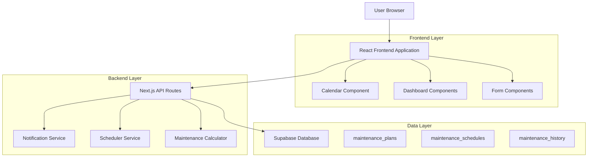
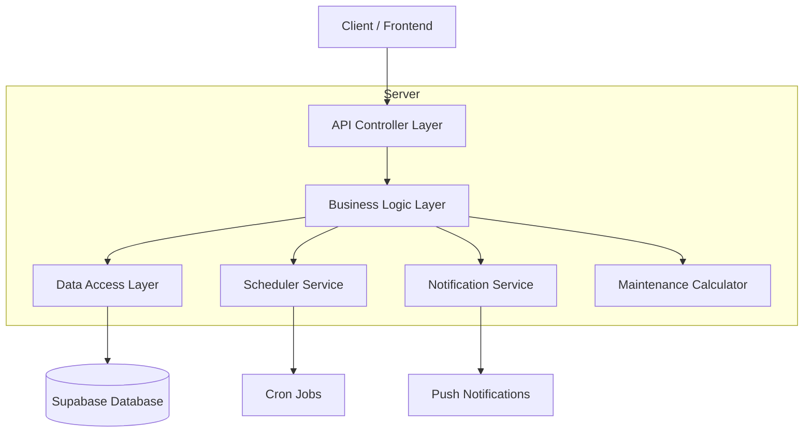
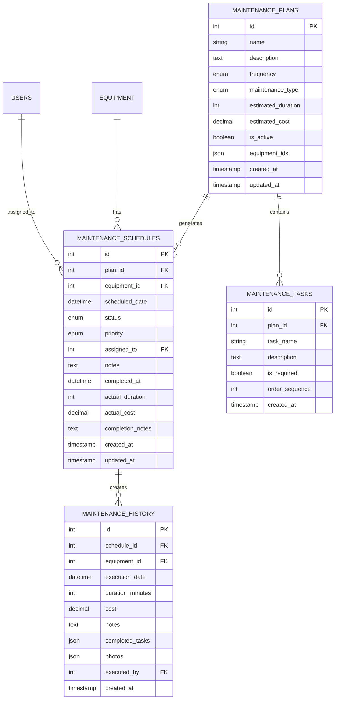

# Documento de Arquitetura Técnica - Módulo de Agendamentos de Manutenção

## 1. Architecture design



## 2. Technology Description

- Frontend: React@18 + Next.js@14 + TypeScript + Tailwind CSS + Shadcn/ui
- Backend: Next.js API Routes + Node.js
- Database: Supabase (PostgreSQL)
- Calendar: React Big Calendar + date-fns
- Notifications: Web Push API + Service Workers
- Scheduling: Node-cron para agendamentos automáticos

## 3. Route definitions

| Route | Purpose |
|-------|---------|
| /agendamentos | Dashboard principal com métricas e visão geral |
| /agendamentos/lista | Lista completa de agendamentos com filtros |
| /agendamentos/calendario | Visualização em calendário dos agendamentos |
| /agendamentos/novo | Formulário para criar novo agendamento |
| /agendamentos/[id] | Detalhes e edição de agendamento específico |
| /agendamentos/planos | Gerenciamento de planos de manutenção |
| /agendamentos/planos/novo | Formulário para criar novo plano |
| /agendamentos/planos/[id] | Edição de plano específico |
| /agendamentos/historico | Histórico de manutenções executadas |
| /agendamentos/relatorios | Relatórios e análises de performance |

## 4. API definitions

### 4.1 Core API

**Planos de Manutenção**
```
GET /api/maintenance-plans
```
Response:
| Param Name | Param Type | Description |
|------------|------------|-------------|
| success | boolean | Status da resposta |
| data | array | Lista de planos de manutenção |

```
POST /api/maintenance-plans
```
Request:
| Param Name | Param Type | isRequired | Description |
|------------|------------|------------|-------------|
| name | string | true | Nome do plano |
| description | string | false | Descrição detalhada |
| frequency | enum | true | DAILY, WEEKLY, MONTHLY, QUARTERLY, SEMIANNUAL, ANNUAL |
| equipment_ids | array | true | IDs dos equipamentos |
| maintenance_type | enum | true | PREVENTIVE, CORRECTIVE, PREDICTIVE |
| estimated_duration | number | true | Duração estimada em minutos |
| tasks | array | true | Lista de tarefas do checklist |

**Agendamentos de Manutenção**
```
GET /api/maintenance-schedules
```
Query Parameters:
| Param Name | Param Type | Description |
|------------|------------|-------------|
| start_date | string | Data inicial (YYYY-MM-DD) |
| end_date | string | Data final (YYYY-MM-DD) |
| equipment_id | number | Filtrar por equipamento |
| status | enum | SCHEDULED, IN_PROGRESS, COMPLETED, OVERDUE |
| priority | enum | LOW, MEDIUM, HIGH, CRITICAL |

```
POST /api/maintenance-schedules
```
Request:
| Param Name | Param Type | isRequired | Description |
|------------|------------|------------|-------------|
| plan_id | number | false | ID do plano (se baseado em plano) |
| equipment_id | number | true | ID do equipamento |
| scheduled_date | string | true | Data agendada (ISO 8601) |
| priority | enum | true | Prioridade do agendamento |
| assigned_to | number | false | ID do técnico responsável |
| notes | string | false | Observações adicionais |

**Execução de Manutenção**
```
PUT /api/maintenance-schedules/{id}/complete
```
Request:
| Param Name | Param Type | isRequired | Description |
|------------|------------|------------|-------------|
| completed_tasks | array | true | Lista de tarefas concluídas |
| actual_duration | number | true | Tempo real gasto (minutos) |
| actual_cost | number | false | Custo real da manutenção |
| completion_notes | string | false | Observações da execução |
| photos | array | false | URLs das fotos anexadas |

**Dashboard e Métricas**
```
GET /api/maintenance-dashboard
```
Response:
| Param Name | Param Type | Description |
|------------|------------|-------------|
| pending_count | number | Agendamentos pendentes |
| overdue_count | number | Agendamentos vencidos |
| completed_this_month | number | Concluídos no mês atual |
| completion_rate | number | Taxa de cumprimento (%) |
| upcoming_7_days | array | Próximos agendamentos (7 dias) |

## 5. Server architecture diagram



## 6. Data model

### 6.1 Data model definition



### 6.2 Data Definition Language

**Tabela de Planos de Manutenção (maintenance_plans)**
```sql
-- Criar tabela de planos
CREATE TABLE maintenance_plans (
    id UUID PRIMARY KEY DEFAULT gen_random_uuid(),
    name VARCHAR(255) NOT NULL,
    description TEXT,
    frequency VARCHAR(20) NOT NULL CHECK (frequency IN ('DAILY', 'WEEKLY', 'MONTHLY', 'QUARTERLY', 'SEMIANNUAL', 'ANNUAL')),
    maintenance_type VARCHAR(20) NOT NULL CHECK (maintenance_type IN ('PREVENTIVE', 'CORRECTIVE', 'PREDICTIVE')),
    estimated_duration INTEGER NOT NULL DEFAULT 60,
    estimated_cost DECIMAL(10,2) DEFAULT 0.00,
    is_active BOOLEAN DEFAULT true,
    equipment_ids JSONB NOT NULL DEFAULT '[]',
    created_at TIMESTAMP WITH TIME ZONE DEFAULT NOW(),
    updated_at TIMESTAMP WITH TIME ZONE DEFAULT NOW()
);

-- Criar índices
CREATE INDEX idx_maintenance_plans_frequency ON maintenance_plans(frequency);
CREATE INDEX idx_maintenance_plans_active ON maintenance_plans(is_active);
CREATE INDEX idx_maintenance_plans_type ON maintenance_plans(maintenance_type);

-- Permissões Supabase
GRANT SELECT ON maintenance_plans TO anon;
GRANT ALL PRIVILEGES ON maintenance_plans TO authenticated;
```

**Tabela de Agendamentos (maintenance_schedules)**
```sql
-- Criar tabela de agendamentos
CREATE TABLE maintenance_schedules (
    id UUID PRIMARY KEY DEFAULT gen_random_uuid(),
    plan_id UUID REFERENCES maintenance_plans(id) ON DELETE SET NULL,
    equipment_id UUID NOT NULL REFERENCES equipment(id) ON DELETE CASCADE,
    scheduled_date TIMESTAMP WITH TIME ZONE NOT NULL,
    status VARCHAR(20) DEFAULT 'SCHEDULED' CHECK (status IN ('SCHEDULED', 'IN_PROGRESS', 'COMPLETED', 'OVERDUE', 'CANCELLED')),
    priority VARCHAR(20) DEFAULT 'MEDIUM' CHECK (priority IN ('LOW', 'MEDIUM', 'HIGH', 'CRITICAL')),
    assigned_to UUID REFERENCES users(id) ON DELETE SET NULL,
    notes TEXT,
    completed_at TIMESTAMP WITH TIME ZONE,
    actual_duration INTEGER,
    actual_cost DECIMAL(10,2),
    completion_notes TEXT,
    created_at TIMESTAMP WITH TIME ZONE DEFAULT NOW(),
    updated_at TIMESTAMP WITH TIME ZONE DEFAULT NOW()
);

-- Criar índices
CREATE INDEX idx_maintenance_schedules_date ON maintenance_schedules(scheduled_date);
CREATE INDEX idx_maintenance_schedules_status ON maintenance_schedules(status);
CREATE INDEX idx_maintenance_schedules_equipment ON maintenance_schedules(equipment_id);
CREATE INDEX idx_maintenance_schedules_assigned ON maintenance_schedules(assigned_to);
CREATE INDEX idx_maintenance_schedules_priority ON maintenance_schedules(priority);

-- Permissões Supabase
GRANT SELECT ON maintenance_schedules TO anon;
GRANT ALL PRIVILEGES ON maintenance_schedules TO authenticated;
```

**Tabela de Histórico (maintenance_history)**
```sql
-- Criar tabela de histórico
CREATE TABLE maintenance_history (
    id UUID PRIMARY KEY DEFAULT gen_random_uuid(),
    schedule_id UUID NOT NULL REFERENCES maintenance_schedules(id) ON DELETE CASCADE,
    equipment_id UUID NOT NULL REFERENCES equipment(id) ON DELETE CASCADE,
    execution_date TIMESTAMP WITH TIME ZONE NOT NULL,
    duration_minutes INTEGER NOT NULL,
    cost DECIMAL(10,2) DEFAULT 0.00,
    notes TEXT,
    completed_tasks JSONB DEFAULT '[]',
    photos JSONB DEFAULT '[]',
    executed_by UUID REFERENCES users(id) ON DELETE SET NULL,
    created_at TIMESTAMP WITH TIME ZONE DEFAULT NOW()
);

-- Criar índices
CREATE INDEX idx_maintenance_history_schedule ON maintenance_history(schedule_id);
CREATE INDEX idx_maintenance_history_equipment ON maintenance_history(equipment_id);
CREATE INDEX idx_maintenance_history_date ON maintenance_history(execution_date);
CREATE INDEX idx_maintenance_history_executed_by ON maintenance_history(executed_by);

-- Permissões Supabase
GRANT SELECT ON maintenance_history TO anon;
GRANT ALL PRIVILEGES ON maintenance_history TO authenticated;
```

**Tabela de Tarefas (maintenance_tasks)**
```sql
-- Criar tabela de tarefas
CREATE TABLE maintenance_tasks (
    id UUID PRIMARY KEY DEFAULT gen_random_uuid(),
    plan_id UUID NOT NULL REFERENCES maintenance_plans(id) ON DELETE CASCADE,
    task_name VARCHAR(255) NOT NULL,
    description TEXT,
    is_required BOOLEAN DEFAULT true,
    order_sequence INTEGER DEFAULT 1,
    created_at TIMESTAMP WITH TIME ZONE DEFAULT NOW()
);

-- Criar índices
CREATE INDEX idx_maintenance_tasks_plan ON maintenance_tasks(plan_id);
CREATE INDEX idx_maintenance_tasks_order ON maintenance_tasks(order_sequence);

-- Permissões Supabase
GRANT SELECT ON maintenance_tasks TO anon;
GRANT ALL PRIVILEGES ON maintenance_tasks TO authenticated;
```

**Dados Iniciais**
```sql
-- Inserir planos de exemplo
INSERT INTO maintenance_plans (name, description, frequency, maintenance_type, estimated_duration, estimated_cost, equipment_ids) VALUES
('Manutenção Preventiva Mensal', 'Verificação geral mensal de equipamentos críticos', 'MONTHLY', 'PREVENTIVE', 120, 200.00, '[]'),
('Calibração Trimestral', 'Calibração de precisão a cada 3 meses', 'QUARTERLY', 'PREVENTIVE', 180, 500.00, '[]'),
('Limpeza Semanal', 'Limpeza e desinfecção semanal', 'WEEKLY', 'PREVENTIVE', 60, 50.00, '[]');

-- Inserir tarefas de exemplo
INSERT INTO maintenance_tasks (plan_id, task_name, description, is_required, order_sequence) 
SELECT 
    p.id,
    task_data.name,
    task_data.desc,
    task_data.required,
    task_data.seq
FROM maintenance_plans p,
(VALUES 
    ('Inspeção Visual', 'Verificar estado geral do equipamento', true, 1),
    ('Teste de Funcionamento', 'Testar todas as funções principais', true, 2),
    ('Limpeza Externa', 'Limpar superfícies externas', true, 3),
    ('Documentação', 'Registrar observações e medições', true, 4)
) AS task_data(name, desc, required, seq)
WHERE p.name = 'Manutenção Preventiva Mensal';
```