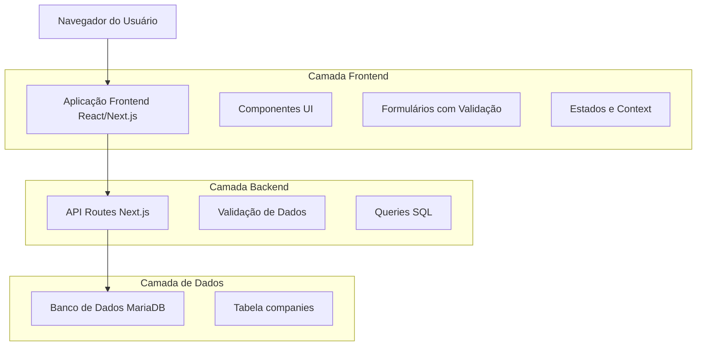
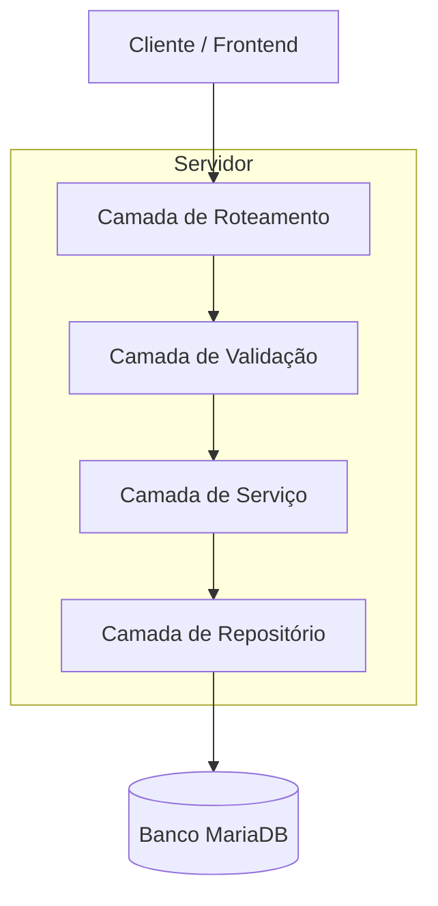
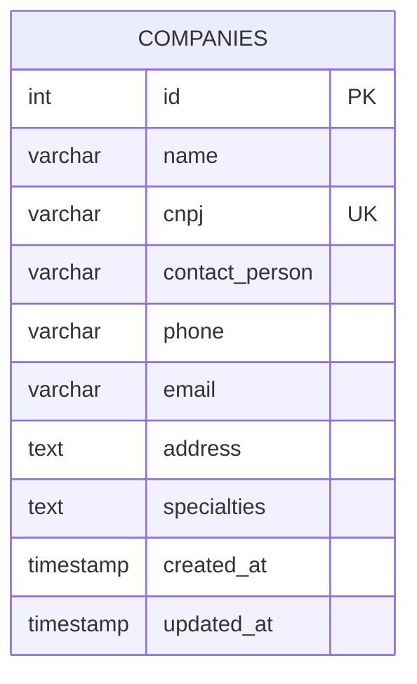

# Documento de Arquitetura Técnica - Empresas Terceirizadas

## 1. Design da Arquitetura



## 2. Descrição das Tecnologias

- Frontend: Next.js@14 + TypeScript + Tailwind CSS + shadcn/ui
- Backend: Next.js API Routes
- Banco de Dados: MariaDB
- Validação: Zod + React Hook Form
- Ícones: Lucide React

## 3. Definições de Rotas

| Rota | Propósito |
|------|-----------|
| /empresas | Página principal de listagem de empresas terceirizadas |
| /empresas/nova | Formulário de cadastro de nova empresa |
| /empresas/[id]/editar | Formulário de edição de empresa existente |

## 4. Definições de API

### 4.1 API Principal

**Listar empresas**
```
GET /api/companies
```

Query Parameters:
| Nome do Parâmetro | Tipo | Obrigatório | Descrição |
|-------------------|------|-------------|-----------|
| search | string | false | Busca por nome ou CNPJ |
| page | number | false | Número da página (padrão: 1) |
| limit | number | false | Itens por página (padrão: 10) |

Response:
| Nome do Parâmetro | Tipo | Descrição |
|-------------------|------|-----------|
| companies | array | Lista de empresas |
| total | number | Total de empresas |
| page | number | Página atual |
| totalPages | number | Total de páginas |

**Criar empresa**
```
POST /api/companies
```

Request:
| Nome do Parâmetro | Tipo | Obrigatório | Descrição |
|-------------------|------|-------------|-----------|
| name | string | true | Nome da empresa |
| cnpj | string | true | CNPJ da empresa (formato: 00.000.000/0000-00) |
| contact_person | string | true | Nome da pessoa de contato |
| phone | string | true | Telefone (formato: (11) 99999-9999) |
| email | string | true | E-mail válido |
| address | string | true | Endereço completo |
| specialties | string | true | Especialidades separadas por vírgula |

Response:
| Nome do Parâmetro | Tipo | Descrição |
|-------------------|------|-----------|
| success | boolean | Status da operação |
| company | object | Dados da empresa criada |
| message | string | Mensagem de feedback |

**Obter empresa por ID**
```
GET /api/companies/[id]
```

Response:
| Nome do Parâmetro | Tipo | Descrição |
|-------------------|------|-----------|
| company | object | Dados completos da empresa |

**Atualizar empresa**
```
PUT /api/companies/[id]
```

Request: Mesma estrutura do POST

Response:
| Nome do Parâmetro | Tipo | Descrição |
|-------------------|------|-----------|
| success | boolean | Status da operação |
| company | object | Dados da empresa atualizada |
| message | string | Mensagem de feedback |

**Excluir empresa**
```
DELETE /api/companies/[id]
```

Response:
| Nome do Parâmetro | Tipo | Descrição |
|-------------------|------|-----------|
| success | boolean | Status da operação |
| message | string | Mensagem de feedback |

Exemplo de Request (POST):
```json
{
  "name": "TechMed Soluções",
  "cnpj": "12.345.678/0001-90",
  "contact_person": "João Silva",
  "phone": "(11) 99999-9999",
  "email": "contato@techmed.com",
  "address": "Rua das Flores, 123 - São Paulo, SP",
  "specialties": "Biomédica, Elétrica, Refrigeração"
}
```

## 5. Arquitetura do Servidor



## 6. Modelo de Dados

### 6.1 Definição do Modelo de Dados



### 6.2 Linguagem de Definição de Dados

**Tabela de Empresas (companies)**
```sql
-- Criar tabela
CREATE TABLE companies (
    id INT AUTO_INCREMENT PRIMARY KEY,
    name VARCHAR(255) NOT NULL,
    cnpj VARCHAR(18) NOT NULL UNIQUE,
    contact_person VARCHAR(255) NOT NULL,
    phone VARCHAR(20) NOT NULL,
    email VARCHAR(255) NOT NULL,
    address TEXT NOT NULL,
    specialties TEXT NOT NULL,
    created_at TIMESTAMP DEFAULT CURRENT_TIMESTAMP,
    updated_at TIMESTAMP DEFAULT CURRENT_TIMESTAMP ON UPDATE CURRENT_TIMESTAMP
);

-- Criar índices
CREATE INDEX idx_companies_name ON companies(name);
CREATE INDEX idx_companies_cnpj ON companies(cnpj);
CREATE INDEX idx_companies_email ON companies(email);
CREATE INDEX idx_companies_created_at ON companies(created_at DESC);

-- Dados iniciais de exemplo
INSERT INTO companies (name, cnpj, contact_person, phone, email, address, specialties) VALUES
('TechMed Soluções', '12.345.678/0001-90', 'João Silva', '(11) 99999-9999', 'contato@techmed.com', 'Rua das Flores, 123 - São Paulo, SP', 'Biomédica, Elétrica'),
('MedEquip Manutenção', '98.765.432/0001-10', 'Maria Santos', '(11) 88888-8888', 'maria@medequip.com', 'Av. Paulista, 456 - São Paulo, SP', 'Refrigeração, Ar Condicionado'),
('BioTech Serviços', '11.222.333/0001-44', 'Carlos Oliveira', '(11) 77777-7777', 'carlos@biotech.com', 'Rua da Saúde, 789 - São Paulo, SP', 'Biomédica, Eletrônica');
```