# Arquitetura Técnica - Melhorias no Módulo de Agendamentos

## 1. Arquitetura Geral


## 2. Descrição Tecnológica

### 2.1 Stack Principal
- **Frontend:** React 18 + TypeScript + Tailwind CSS + Vite
- **Backend:** Node.js + Express.js
- **Banco de Dados:** MySQL/MariaDB
- **Notificações:** WebSocket + Push API
- **Gráficos:** Chart.js
- **Estado:** React Context API + Hooks

### 2.2 Dependências Adicionais
- **Frontend:**
  - `@types/react@18`
  - `tailwindcss@3`
  - `chart.js@4`
  - `date-fns@2`
  - `react-hook-form@7`
  - `react-query@4`
  - `lucide-react@0.3`

- **Backend:**
  - `express@4`
  - `mysql2@3`
  - `node-cron@3`
  - `ws@8`
  - `joi@17`

## 3. Definições de Rotas

### 3.1 Rotas Frontend
| Rota | Propósito | Componente Principal |
|------|-----------|---------------------|
| `/agendamentos/novo` | Formulário de novo agendamento com melhorias | NovoAgendamentoPage |
| `/agendamentos` | Lista de agendamentos com filtros | AgendamentosPage |
| `/ordens-servico` | Ordens de serviço com histórico integrado | OrdensServicoPage |
| `/dashboard` | Dashboard com notificações e métricas | DashboardPage |
| `/notificacoes` | Centro de notificações | NotificacoesPage |

### 3.2 Rotas API Existentes (Modificadas)
| Rota | Método | Propósito |
|------|--------|-----------|
| `/api/maintenance-schedules` | GET/POST/PUT | CRUD de agendamentos |
| `/api/service-orders` | GET | Ordens de serviço |
| `/api/equipment` | GET | Equipamentos |

### 3.3 Novas Rotas API
| Rota | Método | Propósito |
|------|--------|-----------|
| `/api/equipment/{id}/history` | GET | Histórico de manutenção do equipamento |
| `/api/equipment/{id}/stats` | GET | Estatísticas de manutenção |
| `/api/maintenance-plans` | GET/POST/PUT/DELETE | CRUD de planos de manutenção |
| `/api/maintenance-plans/{id}/apply` | POST | Aplicar plano a um agendamento |
| `/api/notifications` | GET/POST/PUT | CRUD de notificações |
| `/api/notifications/mark-read` | PUT | Marcar notificações como lidas |
| `/api/dashboard/metrics` | GET | Métricas para dashboard |

## 4. Definições de API

### 4.1 API de Histórico de Equipamentos

#### GET /api/equipment/{id}/history
**Parâmetros de Query:**
| Nome | Tipo | Obrigatório | Descrição |
|------|------|-------------|-----------|
| limit | number | false | Número máximo de registros (padrão: 10) |
| offset | number | false | Offset para paginação (padrão: 0) |
| type | string | false | Filtro por tipo de manutenção |
| status | string | false | Filtro por status |

**Resposta:**
```json
{
  "success": true,
  "data": {
    "equipment_id": 123,
    "equipment_name": "Ventilador Pulmonar XYZ",
    "history": [
      {
        "id": 1,
        "order_number": "OS-001/2024",
        "type": "PREVENTIVA",
        "status": "CONCLUIDA",
        "requested_date": "2024-01-10",
        "completion_date": "2024-01-15",
        "cost": 1500.00,
        "company": "Empresa ABC Ltda",
        "observations": "Manutenção realizada conforme cronograma"
      }
    ],
    "statistics": {
      "total_maintenances": 15,
      "average_interval_days": 30,
      "success_rate": 95.5,
      "total_cost": 22500.00,
      "last_maintenance": "2024-01-15",
      "next_scheduled": "2024-02-15"
    },
    "pagination": {
      "total": 15,
      "limit": 10,
      "offset": 0,
      "has_more": true
    }
  }
}
```

### 4.2 API de Planos de Manutenção

#### GET /api/maintenance-plans
**Resposta:**
```json
{
  "success": true,
  "data": [
    {
      "id": 1,
      "name": "Manutenção Preventiva Mensal",
      "description": "Verificação geral mensal dos equipamentos",
      "maintenance_type_id": 1,
      "maintenance_type_name": "PREVENTIVA",
      "frequency_days": 30,
      "estimated_cost": 500.00,
      "priority": "MEDIA",
      "is_active": true,
      "tasks": [
        "Verificar funcionamento geral",
        "Limpar filtros",
        "Calibrar sensores"
      ]
    }
  ]
}
```

#### POST /api/maintenance-plans/{id}/apply
**Request Body:**
```json
{
  "equipment_id": 123,
  "scheduled_date": "2024-02-15"
}
```

**Resposta:**
```json
{
  "success": true,
  "data": {
    "maintenance_type_id": 1,
    "description": "Manutenção Preventiva Mensal - Verificação geral mensal dos equipamentos",
    "priority": "MEDIA",
    "estimated_cost": 500.00,
    "next_maintenance_date": "2024-03-15",
    "tasks": [
      "Verificar funcionamento geral",
      "Limpar filtros",
      "Calibrar sensores"
    ]
  }
}
```

### 4.3 API de Notificações

#### GET /api/notifications
**Parâmetros de Query:**
| Nome | Tipo | Obrigatório | Descrição |
|------|------|-------------|-----------|
| user_id | number | true | ID do usuário |
| unread_only | boolean | false | Apenas não lidas |
| type | string | false | Tipo de notificação |

**Resposta:**
```json
{
  "success": true,
  "data": {
    "notifications": [
      {
        "id": 1,
        "type": "PREVENTIVE",
        "title": "Manutenção Preventiva Próxima",
        "message": "Equipamento Ventilador XYZ precisa de manutenção em 3 dias",
        "equipment_id": 123,
        "equipment_name": "Ventilador Pulmonar XYZ",
        "is_read": false,
        "created_at": "2024-01-12T10:30:00Z",
        "priority": "MEDIA"
      }
    ],
    "unread_count": 5,
    "total": 25
  }
}
```

#### POST /api/notifications
**Request Body:**
```json
{
  "user_id": 1,
  "type": "PREVENTIVE",
  "title": "Manutenção Preventiva Próxima",
  "message": "Equipamento precisa de manutenção",
  "equipment_id": 123,
  "schedule_id": 456
}
```

## 5. Arquitetura de Componentes

### 5.1 Estrutura de Componentes


### 5.2 Componente EquipmentHistory

```typescript
// components/EquipmentHistory.tsx
interface EquipmentHistoryProps {
  equipmentId: number;
  compact?: boolean;
  showFilters?: boolean;
  maxItems?: number;
  onViewFullHistory?: () => void;
}

interface MaintenanceRecord {
  id: number;
  order_number: string;
  type: 'PREVENTIVA' | 'CORRETIVA' | 'PREDITIVA';
  status: 'CONCLUIDA' | 'EM_ANDAMENTO' | 'CANCELADA';
  requested_date: string;
  completion_date?: string;
  cost?: number;
  company?: string;
  observations?: string;
}

interface EquipmentStats {
  total_maintenances: number;
  average_interval_days: number;
  success_rate: number;
  total_cost: number;
  last_maintenance?: string;
  next_scheduled?: string;
}

const EquipmentHistory: React.FC<EquipmentHistoryProps> = ({
  equipmentId,
  compact = false,
  showFilters = true,
  maxItems = 5,
  onViewFullHistory
}) => {
  const [history, setHistory] = useState<MaintenanceRecord[]>([]);
  const [stats, setStats] = useState<EquipmentStats | null>(null);
  const [loading, setLoading] = useState(true);
  const [filters, setFilters] = useState({
    type: '',
    status: '',
    dateRange: ''
  });

  // Implementação do componente
  return (
    <div className="equipment-history">
      {/* Estatísticas resumidas */}
      {stats && (
        <div className="stats-summary grid grid-cols-2 md:grid-cols-4 gap-4 mb-6">
          <StatCard 
            title="Total de Manutenções" 
            value={stats.total_maintenances}
            icon="wrench"
          />
          <StatCard 
            title="Intervalo Médio" 
            value={`${stats.average_interval_days} dias`}
            icon="calendar"
          />
          <StatCard 
            title="Taxa de Sucesso" 
            value={`${stats.success_rate}%`}
            icon="check-circle"
            color={stats.success_rate > 90 ? 'green' : stats.success_rate > 70 ? 'yellow' : 'red'}
          />
          <StatCard 
            title="Custo Total" 
            value={`R$ ${stats.total_cost.toLocaleString()}`}
            icon="dollar-sign"
          />
        </div>
      )}

      {/* Filtros */}
      {showFilters && (
        <div className="filters mb-4">
          <FilterBar filters={filters} onFiltersChange={setFilters} />
        </div>
      )}

      {/* Timeline de manutenções */}
      <div className="history-timeline">
        {loading ? (
          <HistoryLoader />
        ) : history.length > 0 ? (
          <>
            <HistoryTimeline 
              maintenances={history.slice(0, maxItems)} 
              compact={compact}
            />
            {history.length > maxItems && onViewFullHistory && (
              <button 
                onClick={onViewFullHistory}
                className="view-full-history-btn"
              >
                Ver Histórico Completo ({history.length} registros)
              </button>
            )}
          </>
        ) : (
          <EmptyHistoryState />
        )}
      </div>
    </div>
  );
};
```

### 5.3 Componente MaintenancePlanSelector

```typescript
// components/MaintenancePlanSelector.tsx
interface MaintenancePlanSelectorProps {
  onPlanSelect: (plan: MaintenancePlan) => void;
  equipmentId?: number;
  selectedPlanId?: number;
}

interface MaintenancePlan {
  id: number;
  name: string;
  description: string;
  maintenance_type_id: number;
  maintenance_type_name: string;
  frequency_days: number;
  estimated_cost: number;
  priority: 'BAIXA' | 'MEDIA' | 'ALTA' | 'CRITICA';
  tasks: string[];
}

const MaintenancePlanSelector: React.FC<MaintenancePlanSelectorProps> = ({
  onPlanSelect,
  equipmentId,
  selectedPlanId
}) => {
  const [plans, setPlans] = useState<MaintenancePlan[]>([]);
  const [loading, setLoading] = useState(true);
  const [selectedPlan, setSelectedPlan] = useState<MaintenancePlan | null>(null);

  const handlePlanSelect = async (plan: MaintenancePlan) => {
    setSelectedPlan(plan);
    
    // Aplicar o plano e obter dados preenchidos
    try {
      const response = await fetch(`/api/maintenance-plans/${plan.id}/apply`, {
        method: 'POST',
        headers: { 'Content-Type': 'application/json' },
        body: JSON.stringify({ equipment_id: equipmentId })
      });
      
      const result = await response.json();
      
      if (result.success) {
        onPlanSelect({
          ...plan,
          ...result.data
        });
        
        // Mostrar toast de sucesso
        showToast('Plano aplicado com sucesso!', 'success');
      }
    } catch (error) {
      showToast('Erro ao aplicar plano', 'error');
    }
  };

  return (
    <div className="maintenance-plan-selector">
      <label className="block text-sm font-medium text-gray-700 mb-2">
        Plano de Ação
      </label>
      
      <div className="plans-grid grid grid-cols-1 md:grid-cols-2 gap-4">
        {plans.map(plan => (
          <PlanCard
            key={plan.id}
            plan={plan}
            selected={selectedPlanId === plan.id}
            onSelect={() => handlePlanSelect(plan)}
          />
        ))}
      </div>

      {selectedPlan && (
        <div className="selected-plan-preview mt-4">
          <PlanPreview plan={selectedPlan} />
        </div>
      )}
    </div>
  );
};
```

## 6. Modelo de Dados

### 6.1 Diagrama Entidade-Relacionamento

```mermaid
erDiagram
    EQUIPMENT ||--o{ SERVICE_ORDERS : has
    EQUIPMENT ||--o{ MAINTENANCE_SCHEDULES : has
    EQUIPMENT ||--|| EQUIPMENT_MAINTENANCE_STATS : has
    
    MAINTENANCE_PLANS ||--o{ MAINTENANCE_SCHEDULES : generates
    MAINTENANCE_TYPES ||--o{ MAINTENANCE_PLANS : categorizes
    MAINTENANCE_TYPES ||--o{ SERVICE_ORDERS : categorizes
    
    USERS ||--o{ NOTIFICATIONS : receives
    USERS ||--o{ MAINTENANCE_SCHEDULES : creates
    
    EMPRESAS ||--o{ SERVICE_ORDERS : executes
    
    EQUIPMENT {
        int id PK
        string name
        string model
        string serial_number
        int sector_id FK
        datetime created_at
    }
    
    SERVICE_ORDERS {
        int id PK
        string order_number
        int equipment_id FK
        int company_id FK
        text description
        enum priority
        enum status
        date requested_date
        date completion_date
        decimal cost
        int maintenance_type_id FK
    }
    
    MAINTENANCE_SCHEDULES {
        int id PK
        int equipment_id FK
        int maintenance_type_id FK
        int maintenance_plan_id FK
        text description
        enum priority
        date scheduled_date
        date next_maintenance_date
        boolean auto_filled
        int created_by FK
    }
    
    MAINTENANCE_PLANS {
        int id PK
        string name
        text description
        int maintenance_type_id FK
        int frequency_days
        decimal estimated_cost
        enum priority
        boolean is_active
    }
    
    MAINTENANCE_TYPES {
        int id PK
        string name
        text description
        boolean is_active
    }
    
    NOTIFICATIONS {
        int id PK
        int user_id FK
        enum type
        string title
        text message
        int equipment_id FK
        int schedule_id FK
        boolean is_read
        datetime created_at
    }
    
    EQUIPMENT_MAINTENANCE_STATS {
        int id PK
        int equipment_id FK
        int total_maintenances
        int average_interval_days
        decimal success_rate
        decimal total_cost
        date last_maintenance_date
        date next_maintenance_date
    }
    
    USERS {
        int id PK
        string name
        string email
        string password_hash
    }
    
    EMPRESAS {
        int id PK
        string name
        string cnpj
        boolean is_active
    }
```



### 6.2 Definições DDL

#### 6.2.1 Tabela maintenance_plans
```sql
CREATE TABLE maintenance_plans (
    id INT(11) NOT NULL AUTO_INCREMENT,
    name VARCHAR(100) NOT NULL COMMENT 'Nome do plano de manutenção',
    description TEXT NULL COMMENT 'Descrição detalhada do plano',
    maintenance_type_id INT(11) NOT NULL COMMENT 'Tipo de manutenção (FK)',
    frequency_days INT(11) NOT NULL COMMENT 'Frequência em dias',
    estimated_cost DECIMAL(10,2) NULL COMMENT 'Custo estimado',
    priority ENUM('BAIXA','MEDIA','ALTA','CRITICA') DEFAULT 'MEDIA' COMMENT 'Prioridade padrão',
    tasks JSON NULL COMMENT 'Lista de tarefas do plano',
    is_active BOOLEAN DEFAULT TRUE COMMENT 'Plano ativo',
    created_at TIMESTAMP DEFAULT CURRENT_TIMESTAMP,
    updated_at TIMESTAMP DEFAULT CURRENT_TIMESTAMP ON UPDATE CURRENT_TIMESTAMP,
    PRIMARY KEY (id),
    FOREIGN KEY (maintenance_type_id) REFERENCES maintenance_types(id) ON DELETE RESTRICT,
    INDEX idx_maintenance_plans_type (maintenance_type_id),
    INDEX idx_maintenance_plans_active (is_active)
) ENGINE=InnoDB DEFAULT CHARSET=utf8mb4 COLLATE=utf8mb4_unicode_ci;

-- Dados iniciais
INSERT INTO maintenance_plans (name, description, maintenance_type_id, frequency_days, estimated_cost, priority, tasks) VALUES
('Manutenção Preventiva Mensal', 'Verificação geral mensal dos equipamentos', 1, 30, 500.00, 'MEDIA', '["Verificar funcionamento geral", "Limpar filtros", "Calibrar sensores"]'),
('Manutenção Preventiva Trimestral', 'Manutenção preventiva a cada 3 meses', 1, 90, 1200.00, 'ALTA', '["Revisão completa", "Troca de peças de desgaste", "Testes de segurança"]'),
('Manutenção Corretiva Urgente', 'Reparo imediato para equipamentos críticos', 2, 0, 2000.00, 'CRITICA', '["Diagnóstico do problema", "Reparo ou substituição", "Testes funcionais"]');
```

#### 6.2.2 Tabela notifications
```sql
CREATE TABLE notifications (
    id INT(11) NOT NULL AUTO_INCREMENT,
    user_id INT(11) NOT NULL COMMENT 'Usuário destinatário',
    type ENUM('PREVENTIVE','OVERDUE','CRITICAL','INFO') NOT NULL COMMENT 'Tipo de notificação',
    title VARCHAR(200) NOT NULL COMMENT 'Título da notificação',
    message TEXT NOT NULL COMMENT 'Mensagem da notificação',
    equipment_id INT(11) NULL COMMENT 'Equipamento relacionado (opcional)',
    schedule_id INT(11) NULL COMMENT 'Agendamento relacionado (opcional)',
    is_read BOOLEAN DEFAULT FALSE COMMENT 'Notificação lida',
    priority ENUM('LOW','MEDIUM','HIGH','CRITICAL') DEFAULT 'MEDIUM' COMMENT 'Prioridade da notificação',
    created_at TIMESTAMP DEFAULT CURRENT_TIMESTAMP,
    read_at TIMESTAMP NULL COMMENT 'Data/hora da leitura',
    expires_at TIMESTAMP NULL COMMENT 'Data de expiração (opcional)',
    PRIMARY KEY (id),
    FOREIGN KEY (user_id) REFERENCES users(id) ON DELETE CASCADE,
    FOREIGN KEY (equipment_id) REFERENCES equipment(id) ON DELETE SET NULL,
    FOREIGN KEY (schedule_id) REFERENCES maintenance_schedules(id) ON DELETE SET NULL,
    INDEX idx_notifications_user_unread (user_id, is_read),
    INDEX idx_notifications_type (type),
    INDEX idx_notifications_created (created_at DESC),
    INDEX idx_notifications_equipment (equipment_id)
) ENGINE=InnoDB DEFAULT CHARSET=utf8mb4 COLLATE=utf8mb4_unicode_ci;
```

#### 6.2.3 Tabela equipment_maintenance_stats
```sql
CREATE TABLE equipment_maintenance_stats (
    id INT(11) NOT NULL AUTO_INCREMENT,
    equipment_id INT(11) NOT NULL COMMENT 'Equipamento (FK)',
    total_maintenances INT(11) DEFAULT 0 COMMENT 'Total de manutenções realizadas',
    average_interval_days INT(11) DEFAULT 0 COMMENT 'Intervalo médio entre manutenções',
    success_rate DECIMAL(5,2) DEFAULT 0 COMMENT 'Taxa de sucesso (%)',
    total_cost DECIMAL(12,2) DEFAULT 0 COMMENT 'Custo total acumulado',
    last_maintenance_date DATE NULL COMMENT 'Data da última manutenção',
    next_maintenance_date DATE NULL COMMENT 'Próxima manutenção programada',
    preventive_count INT(11) DEFAULT 0 COMMENT 'Manutenções preventivas',
    corrective_count INT(11) DEFAULT 0 COMMENT 'Manutenções corretivas',
    average_cost DECIMAL(10,2) DEFAULT 0 COMMENT 'Custo médio por manutenção',
    updated_at TIMESTAMP DEFAULT CURRENT_TIMESTAMP ON UPDATE CURRENT_TIMESTAMP,
    PRIMARY KEY (id),
    UNIQUE KEY uk_equipment_stats (equipment_id),
    FOREIGN KEY (equipment_id) REFERENCES equipment(id) ON DELETE CASCADE,
    INDEX idx_stats_next_maintenance (next_maintenance_date),
    INDEX idx_stats_success_rate (success_rate DESC)
) ENGINE=InnoDB DEFAULT CHARSET=utf8mb4 COLLATE=utf8mb4_unicode_ci;
```

#### 6.2.4 Modificações na tabela maintenance_schedules
```sql
-- Adicionar colunas para integração com planos
ALTER TABLE maintenance_schedules 
ADD COLUMN maintenance_plan_id INT(11) NULL COMMENT 'Plano de manutenção aplicado (FK)',
ADD COLUMN auto_filled BOOLEAN DEFAULT FALSE COMMENT 'Campos preenchidos automaticamente',
ADD COLUMN next_maintenance_date DATE NULL COMMENT 'Próxima manutenção calculada',
ADD COLUMN estimated_cost DECIMAL(10,2) NULL COMMENT 'Custo estimado',
ADD CONSTRAINT fk_schedules_plan 
FOREIGN KEY (maintenance_plan_id) REFERENCES maintenance_plans(id) ON DELETE SET NULL;

-- Índices para performance
CREATE INDEX idx_schedules_plan ON maintenance_schedules(maintenance_plan_id);
CREATE INDEX idx_schedules_next_date ON maintenance_schedules(next_maintenance_date);
CREATE INDEX idx_schedules_auto_filled ON maintenance_schedules(auto_filled);
```

### 6.3 Triggers e Procedures

#### 6.3.1 Trigger para atualizar estatísticas
```sql
DELIMITER $$
CREATE TRIGGER tr_update_equipment_stats_after_service_order
AFTER UPDATE ON service_orders
FOR EACH ROW
BEGIN
    DECLARE done INT DEFAULT FALSE;
    DECLARE total_count INT DEFAULT 0;
    DECLARE preventive_count INT DEFAULT 0;
    DECLARE corrective_count INT DEFAULT 0;
    DECLARE total_cost DECIMAL(12,2) DEFAULT 0;
    DECLARE avg_cost DECIMAL(10,2) DEFAULT 0;
    DECLARE success_count INT DEFAULT 0;
    DECLARE success_rate DECIMAL(5,2) DEFAULT 0;
    DECLARE last_date DATE DEFAULT NULL;
    DECLARE avg_interval INT DEFAULT 0;
    
    -- Só atualiza se o status mudou para CONCLUIDA
    IF NEW.status = 'CONCLUIDA' AND OLD.status != 'CONCLUIDA' THEN
        
        -- Calcular estatísticas
        SELECT 
            COUNT(*),
            SUM(CASE WHEN type = 'PREVENTIVA' THEN 1 ELSE 0 END),
            SUM(CASE WHEN type = 'CORRETIVA' THEN 1 ELSE 0 END),
            COALESCE(SUM(cost), 0),
            COALESCE(AVG(cost), 0),
            SUM(CASE WHEN status = 'CONCLUIDA' THEN 1 ELSE 0 END),
            MAX(completion_date)
        INTO 
            total_count, preventive_count, corrective_count, 
            total_cost, avg_cost, success_count, last_date
        FROM service_orders 
        WHERE equipment_id = NEW.equipment_id;
        
        -- Calcular taxa de sucesso
        IF total_count > 0 THEN
            SET success_rate = (success_count * 100.0) / total_count;
        END IF;
        
        -- Calcular intervalo médio (simplificado)
        SELECT COALESCE(AVG(DATEDIFF(completion_date, requested_date)), 0)
        INTO avg_interval
        FROM service_orders 
        WHERE equipment_id = NEW.equipment_id AND status = 'CONCLUIDA';
        
        -- Inserir ou atualizar estatísticas
        INSERT INTO equipment_maintenance_stats (
            equipment_id, total_maintenances, average_interval_days,
            success_rate, total_cost, last_maintenance_date,
            preventive_count, corrective_count, average_cost
        ) VALUES (
            NEW.equipment_id, total_count, avg_interval,
            success_rate, total_cost, last_date,
            preventive_count, corrective_count, avg_cost
        )
        ON DUPLICATE KEY UPDATE
            total_maintenances = total_count,
            average_interval_days = avg_interval,
            success_rate = success_rate,
            total_cost = total_cost,
            last_maintenance_date = last_date,
            preventive_count = preventive_count,
            corrective_count = corrective_count,
            average_cost = avg_cost;
            
    END IF;
END$$
DELIMITER ;
```

#### 6.3.2 Procedure para gerar notificações automáticas
```sql
DELIMITER $$
CREATE PROCEDURE sp_generate_maintenance_notifications()
BEGIN
    DECLARE done INT DEFAULT FALSE;
    DECLARE v_equipment_id INT;
    DECLARE v_equipment_name VARCHAR(255);
    DECLARE v_next_date DATE;
    DECLARE v_days_until INT;
    
    DECLARE cur CURSOR FOR
        SELECT 
            e.id,
            e.name,
            ems.next_maintenance_date,
            DATEDIFF(ems.next_maintenance_date, CURDATE()) as days_until
        FROM equipment e
        INNER JOIN equipment_maintenance_stats ems ON e.id = ems.equipment_id
        WHERE ems.next_maintenance_date IS NOT NULL
        AND DATEDIFF(ems.next_maintenance_date, CURDATE()) BETWEEN 0 AND 7;
    
    DECLARE CONTINUE HANDLER FOR NOT FOUND SET done = TRUE;
    
    OPEN cur;
    
    read_loop: LOOP
        FETCH cur INTO v_equipment_id, v_equipment_name, v_next_date, v_days_until;
        IF done THEN
            LEAVE read_loop;
        END IF;
        
        -- Inserir notificação se não existir uma similar recente
        INSERT INTO notifications (
            user_id, type, title, message, equipment_id, priority
        )
        SELECT 
            u.id,
            'PREVENTIVE',
            CONCAT('Manutenção Preventiva - ', v_equipment_name),
            CONCAT('Equipamento ', v_equipment_name, ' precisa de manutenção em ', v_days_until, ' dias'),
            v_equipment_id,
            CASE 
                WHEN v_days_until <= 1 THEN 'CRITICAL'
                WHEN v_days_until <= 3 THEN 'HIGH'
                ELSE 'MEDIUM'
            END
        FROM users u
        WHERE u.role IN ('ADMIN', 'TECHNICIAN')
        AND NOT EXISTS (
            SELECT 1 FROM notifications n2 
            WHERE n2.user_id = u.id 
            AND n2.equipment_id = v_equipment_id 
            AND n2.type = 'PREVENTIVE'
            AND n2.created_at > DATE_SUB(NOW(), INTERVAL 24 HOUR)
        );
        
    END LOOP;
    
    CLOSE cur;
END$$
DELIMITER ;
```

## 7. Sistema de Notificações em Tempo Real

### 7.1 Arquitetura WebSocket


### 7.2 Implementação do WebSocket Server

```javascript
// api/websocket/notifications.js
const WebSocket = require('ws');
const mysql = require('mysql2/promise');

class NotificationWebSocketServer {
  constructor(server) {
    this.wss = new WebSocket.Server({ server });
    this.clients = new Map(); // userId -> WebSocket
    
    this.wss.on('connection', this.handleConnection.bind(this));
  }
  
  handleConnection(ws, req) {
    ws.on('message', async (message) => {
      try {
        const data = JSON.parse(message);
        
        switch (data.type) {
          case 'auth':
            this.clients.set(data.userId, ws);
            ws.userId = data.userId;
            break;
            
          case 'mark_read':
            await this.markNotificationAsRead(data.notificationId);
            break;
        }
      } catch (error) {
        console.error('WebSocket message error:', error);
      }
    });
    
    ws.on('close', () => {
      if (ws.userId) {
        this.clients.delete(ws.userId);
      }
    });
  }
  
  async sendNotificationToUser(userId, notification) {
    const client = this.clients.get(userId);
    if (client && client.readyState === WebSocket.OPEN) {
      client.send(JSON.stringify({
        type: 'notification',
        data: notification
      }));
    }
  }
  
  async broadcastNotification(notification) {
    const message = JSON.stringify({
      type: 'notification',
      data: notification
    });
    
    this.clients.forEach((client) => {
      if (client.readyState === WebSocket.OPEN) {
        client.send(message);
      }
    });
  }
}

module.exports = NotificationWebSocketServer;
```

## 8. Considerações de Performance

### 8.1 Otimizações de Banco de Dados
- **Índices estratégicos** em colunas de busca frequente
- **Particionamento** da tabela de notificações por data
- **Cache** de estatísticas de equipamentos
- **Queries otimizadas** com LIMIT e paginação

### 8.2 Otimizações de Frontend
- **Lazy loading** de componentes
- **Memoização** de componentes pesados
- **Virtualização** de listas longas
- **Debounce** em filtros e buscas

### 8.3 Otimizações de API
- **Cache Redis** para dados frequentemente acessados
- **Compressão gzip** nas respostas
- **Rate limiting** para prevenir abuso
- **Paginação** em todas as listagens

## 9. Segurança

### 9.1 Autenticação e Autorização
- **JWT tokens** para autenticação
- **RBAC** (Role-Based Access Control)
- **Validação** de permissões em cada endpoint
- **Sanitização** de inputs

### 9.2 Proteção de Dados
- **Validação** de schemas com Joi
- **Escape** de queries SQL
- **HTTPS** obrigatório em produção
- **Rate limiting** por IP e usuário

## 10. Monitoramento e Logs

### 10.1 Métricas de Sistema
- **Tempo de resposta** das APIs
- **Taxa de erro** por endpoint
- **Uso de memória** e CPU
- **Conexões WebSocket** ativas

### 10.2 Logs de Aplicação
- **Logs estruturados** em JSON
- **Níveis de log** (error, warn, info, debug)
- **Correlação** de requests
- **Rotação** automática de logs

### 10.3 Alertas
- **Alertas** para erros críticos
- **Monitoramento** de performance
- **Notificações** para administradores
- **Dashboard** de métricas em tempo real