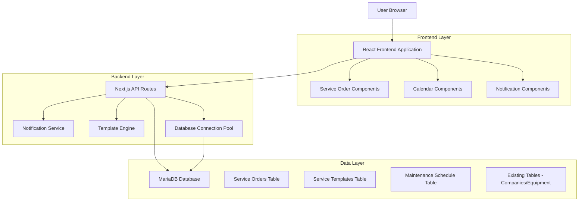
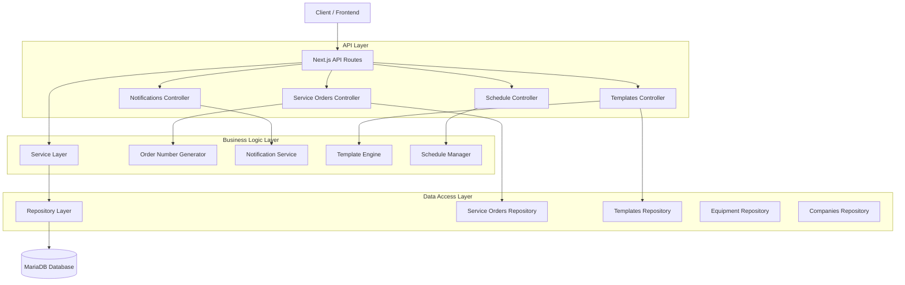
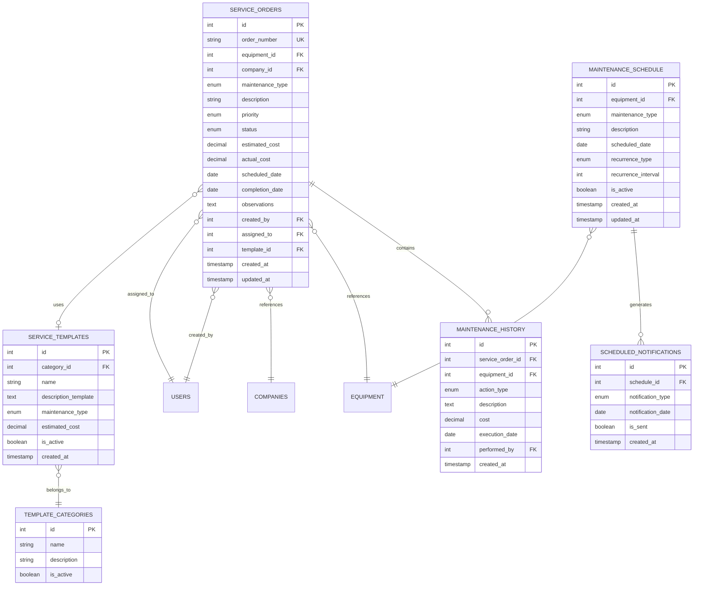

# Arquitetura Técnica - Módulo de Ordem de Serviço

## 1. Architecture design



## 2. Technology Description

- Frontend: React@18 + Next.js@14 + TypeScript + Tailwind CSS@3
- Backend: Next.js API Routes + Node.js
- Database: MariaDB (existing hospital_maintenance database)
- Notifications: Custom notification service integrated with existing system
- UI Components: Lucide React icons + Custom components
- State Management: React hooks + SWR for data fetching

## 3. Route definitions

| Route | Purpose |
|-------|---------|
| /ordens-servico | Página principal do módulo de OS com todas as abas integradas |
| /api/service-orders | CRUD operations para ordens de serviço |
| /api/service-orders/[id] | Operações específicas de uma OS (GET, PUT, DELETE) |
| /api/service-orders/templates | Gerenciamento de templates de descrição |
| /api/service-orders/schedule | Operações de agendamento de manutenções |
| /api/service-orders/history/[equipmentId] | Histórico de manutenções por equipamento |
| /api/service-orders/notifications | Sistema de notificações e alertas |
| /api/service-orders/reports | Geração de relatórios e métricas |

## 4. API definitions

### 4.1 Core API

**Criar nova ordem de serviço**
```
POST /api/service-orders
```

Request:
| Param Name | Param Type | isRequired | Description |
|------------|------------|------------|-------------|
| equipmentId | number | true | ID do equipamento selecionado |
| companyId | number | true | ID da empresa prestadora |
| maintenanceType | string | true | Tipo: 'PREVENTIVA', 'CORRETIVA', 'PREDITIVA' |
| description | string | true | Descrição do serviço (pode usar template) |
| priority | string | true | Prioridade: 'BAIXA', 'MEDIA', 'ALTA' |
| estimatedCost | number | false | Custo estimado do serviço |
| scheduledDate | string | false | Data agendada (ISO format) |
| observations | string | false | Observações adicionais |

Response:
| Param Name | Param Type | Description |
|------------|------------|-------------|
| id | number | ID da OS criada |
| orderNumber | string | Número gerado automaticamente (OS-XXX/YYYY) |
| status | string | Status inicial ('ABERTA') |
| createdAt | string | Data de criação |

**Listar ordens de serviço com paginação**
```
GET /api/service-orders?page=1&limit=10&status=ABERTA&priority=ALTA
```

**Atualizar status da ordem de serviço**
```
PUT /api/service-orders/[id]/status
```

Request:
| Param Name | Param Type | isRequired | Description |
|------------|------------|------------|-------------|
| status | string | true | Novo status: 'ABERTA', 'EM_ANDAMENTO', 'CONCLUIDA', 'CANCELADA' |
| observations | string | false | Observações sobre a mudança de status |
| completionDate | string | false | Data de conclusão (se status = CONCLUIDA) |

**Obter templates de descrição**
```
GET /api/service-orders/templates?type=PREVENTIVA
```

**Agendar manutenção futura**
```
POST /api/service-orders/schedule
```

Request:
| Param Name | Param Type | isRequired | Description |
|------------|------------|------------|-------------|
| equipmentId | number | true | ID do equipamento |
| maintenanceType | string | true | Tipo de manutenção |
| scheduledDate | string | true | Data agendada |
| description | string | true | Descrição da manutenção |
| recurrence | string | false | Recorrência: 'MONTHLY', 'QUARTERLY', 'YEARLY' |

**Obter histórico por equipamento**
```
GET /api/service-orders/history/[equipmentId]?startDate=2024-01-01&endDate=2024-12-31
```

## 5. Server architecture diagram



## 6. Data model

### 6.1 Data model definition



### 6.2 Data Definition Language

**Tabela Principal - service_orders**
```sql
CREATE TABLE service_orders (
    id INT AUTO_INCREMENT PRIMARY KEY,
    order_number VARCHAR(20) UNIQUE NOT NULL,
    equipment_id INT NOT NULL,
    company_id INT NOT NULL,
    maintenance_type ENUM('PREVENTIVA', 'CORRETIVA', 'PREDITIVA', 'EMERGENCIAL') NOT NULL,
    description TEXT NOT NULL,
    priority ENUM('BAIXA', 'MEDIA', 'ALTA', 'CRITICA') DEFAULT 'MEDIA',
    status ENUM('ABERTA', 'EM_ANDAMENTO', 'AGUARDANDO_PECA', 'CONCLUIDA', 'CANCELADA') DEFAULT 'ABERTA',
    estimated_cost DECIMAL(10,2) DEFAULT 0.00,
    actual_cost DECIMAL(10,2) DEFAULT 0.00,
    scheduled_date DATE NULL,
    completion_date DATE NULL,
    observations TEXT NULL,
    created_by INT NOT NULL,
    assigned_to INT NULL,
    template_id INT NULL,
    created_at TIMESTAMP DEFAULT CURRENT_TIMESTAMP,
    updated_at TIMESTAMP DEFAULT CURRENT_TIMESTAMP ON UPDATE CURRENT_TIMESTAMP,
    
    FOREIGN KEY (equipment_id) REFERENCES equipment(id) ON DELETE RESTRICT,
    FOREIGN KEY (company_id) REFERENCES companies(id) ON DELETE RESTRICT,
    FOREIGN KEY (created_by) REFERENCES users(id) ON DELETE RESTRICT,
    FOREIGN KEY (assigned_to) REFERENCES users(id) ON DELETE SET NULL,
    FOREIGN KEY (template_id) REFERENCES service_templates(id) ON DELETE SET NULL
) ENGINE=InnoDB DEFAULT CHARSET=utf8mb4 COLLATE=utf8mb4_unicode_ci;

-- Índices para performance
CREATE INDEX idx_service_orders_equipment ON service_orders(equipment_id);
CREATE INDEX idx_service_orders_company ON service_orders(company_id);
CREATE INDEX idx_service_orders_status ON service_orders(status);
CREATE INDEX idx_service_orders_priority ON service_orders(priority);
CREATE INDEX idx_service_orders_scheduled_date ON service_orders(scheduled_date);
CREATE INDEX idx_service_orders_created_at ON service_orders(created_at DESC);
```

**Tabela de Templates - service_templates**
```sql
CREATE TABLE service_templates (
    id INT AUTO_INCREMENT PRIMARY KEY,
    category_id INT NOT NULL,
    name VARCHAR(100) NOT NULL,
    description_template TEXT NOT NULL,
    maintenance_type ENUM('PREVENTIVA', 'CORRETIVA', 'PREDITIVA', 'EMERGENCIAL') NOT NULL,
    estimated_cost DECIMAL(10,2) DEFAULT 0.00,
    is_active BOOLEAN DEFAULT TRUE,
    created_at TIMESTAMP DEFAULT CURRENT_TIMESTAMP,
    updated_at TIMESTAMP DEFAULT CURRENT_TIMESTAMP ON UPDATE CURRENT_TIMESTAMP,
    
    FOREIGN KEY (category_id) REFERENCES template_categories(id) ON DELETE RESTRICT
) ENGINE=InnoDB DEFAULT CHARSET=utf8mb4 COLLATE=utf8mb4_unicode_ci;
```

**Tabela de Agendamento - maintenance_schedule**
```sql
CREATE TABLE maintenance_schedule (
    id INT AUTO_INCREMENT PRIMARY KEY,
    equipment_id INT NOT NULL,
    maintenance_type ENUM('PREVENTIVA', 'CORRETIVA', 'PREDITIVA') NOT NULL,
    description TEXT NOT NULL,
    scheduled_date DATE NOT NULL,
    recurrence_type ENUM('NONE', 'DAILY', 'WEEKLY', 'MONTHLY', 'QUARTERLY', 'YEARLY') DEFAULT 'NONE',
    recurrence_interval INT DEFAULT 1,
    is_active BOOLEAN DEFAULT TRUE,
    created_by INT NOT NULL,
    created_at TIMESTAMP DEFAULT CURRENT_TIMESTAMP,
    updated_at TIMESTAMP DEFAULT CURRENT_TIMESTAMP ON UPDATE CURRENT_TIMESTAMP,
    
    FOREIGN KEY (equipment_id) REFERENCES equipment(id) ON DELETE CASCADE,
    FOREIGN KEY (created_by) REFERENCES users(id) ON DELETE RESTRICT
) ENGINE=InnoDB DEFAULT CHARSET=utf8mb4 COLLATE=utf8mb4_unicode_ci;

-- Índices para agendamento
CREATE INDEX idx_maintenance_schedule_equipment ON maintenance_schedule(equipment_id);
CREATE INDEX idx_maintenance_schedule_date ON maintenance_schedule(scheduled_date);
CREATE INDEX idx_maintenance_schedule_active ON maintenance_schedule(is_active);
```

**Dados Iniciais - template_categories**
```sql
INSERT INTO template_categories (name, description) VALUES
('Manutenção Preventiva', 'Templates para manutenções preventivas regulares'),
('Manutenção Corretiva', 'Templates para correção de falhas e problemas'),
('Calibração', 'Templates para calibração de equipamentos'),
('Limpeza e Higienização', 'Templates para procedimentos de limpeza'),
('Inspeção Técnica', 'Templates para inspeções e verificações técnicas');

INSERT INTO service_templates (category_id, name, description_template, maintenance_type, estimated_cost) VALUES
(1, 'Manutenção Preventiva Básica', 'Verificação geral do equipamento:\n- Inspeção visual externa\n- Teste de funcionamento\n- Limpeza básica\n- Verificação de cabos e conexões', 'PREVENTIVA', 150.00),
(2, 'Correção de Falha Elétrica', 'Diagnóstico e correção de problema elétrico:\n- Verificação de alimentação\n- Teste de componentes elétricos\n- Substituição de peças defeituosas\n- Teste final de funcionamento', 'CORRETIVA', 300.00),
(3, 'Calibração de Precisão', 'Calibração completa do equipamento:\n- Verificação de padrões de referência\n- Ajuste de parâmetros\n- Emissão de certificado de calibração\n- Documentação técnica', 'PREVENTIVA', 500.00);
```