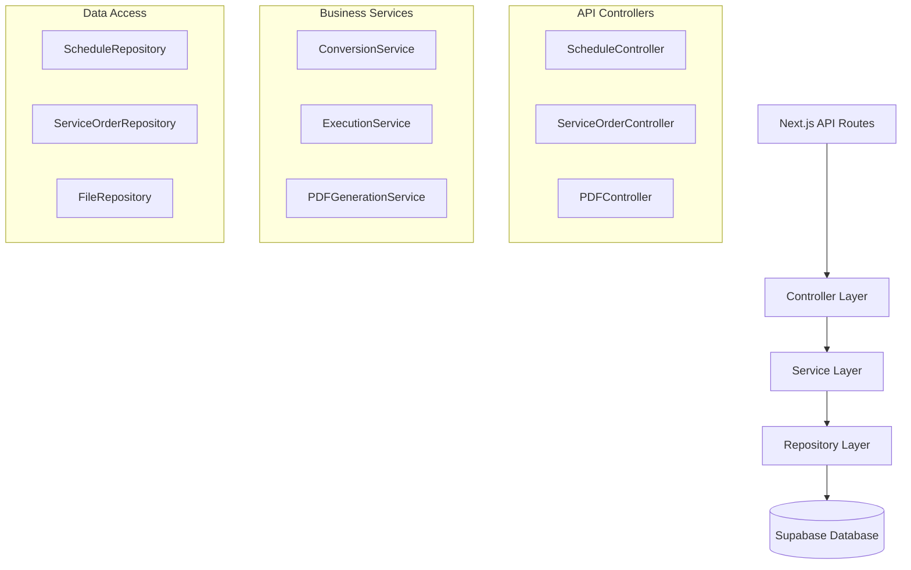
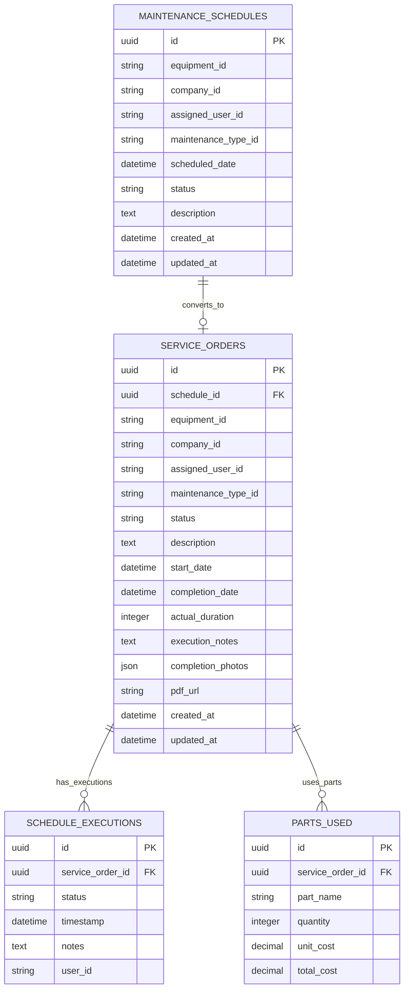

# Documento de Arquitetura Técnica - Integração Agendamentos e Ordens de Serviço

## 1. Design da Arquitetura

```mermaid
graph TD
    A[Frontend React] --> B[API Routes Next.js]
    B --> C[Supabase Database]
    B --> D[PDF Generation Service]
    
    subgraph "Frontend Layer"
        A
        E[Agendamentos Pages]
        F[Ordens de Serviço Pages]
        G[PDF Viewer Component]
    end
    
    subgraph "API Layer"
        B
        H[/api/schedules/convert]
        I[/api/service-orders/execute]
        J[/api/pdf/generate]
    end
    
    subgraph "Data Layer"
        C
        K[(maintenance_schedules)]
        L[(service_orders)]
        M[(schedule_executions)]
    end
    
    subgraph "External Services"
        D
        N[jsPDF Library]
        O[File Storage]
    end
```

## 2. Descrição das Tecnologias

- **Frontend**: React@18 + TypeScript + Tailwind CSS + Next.js@14
- **Backend**: Next.js API Routes + Supabase SDK
- **Database**: Supabase (PostgreSQL)
- **PDF Generation**: jsPDF + html2canvas
- **File Storage**: Supabase Storage

## 3. Definições de Rotas

| Rota | Propósito |
|------|-----------|
| /agendamentos/lista | Lista de agendamentos com botão "Converter em OS" |
| /ordens-servico | Lista de ordens de serviço com origem do agendamento |
| /ordens-servico/[id]/executar | Página de execução da OS com formulário completo |
| /ordens-servico/[id]/pdf | Visualização e download do PDF gerado |
| /dashboard | Dashboard com métricas unificadas do fluxo integrado |

## 4. Definições de API

### 4.1 APIs Principais

**Conversão de Agendamento em OS**
```
POST /api/schedules/convert
```

Request:
| Nome do Parâmetro | Tipo | Obrigatório | Descrição |
|-------------------|------|-------------|-----------|
| schedule_id | string | true | ID do agendamento a ser convertido |
| additional_notes | string | false | Observações adicionais para a OS |

Response:
| Nome do Parâmetro | Tipo | Descrição |
|-------------------|------|-----------|
| success | boolean | Status da operação |
| service_order_id | string | ID da OS criada |
| message | string | Mensagem de confirmação |

Exemplo:
```json
{
  "schedule_id": "uuid-123",
  "additional_notes": "Verificar peças em estoque"
}
```

**Execução de Ordem de Serviço**
```
PUT /api/service-orders/[id]/execute
```

Request:
| Nome do Parâmetro | Tipo | Obrigatório | Descrição |
|-------------------|------|-------------|-----------|
| status | string | true | Status: STARTED, IN_PROGRESS, COMPLETED |
| actual_duration | number | false | Tempo real gasto (minutos) |
| parts_used | array | false | Lista de peças utilizadas |
| execution_notes | string | false | Observações da execução |
| completion_photos | array | false | URLs das fotos de conclusão |

**Geração de PDF**
```
POST /api/service-orders/[id]/generate-pdf
```

Response:
| Nome do Parâmetro | Tipo | Descrição |
|-------------------|------|-----------|
| pdf_url | string | URL do PDF gerado |
| file_name | string | Nome do arquivo |

## 5. Diagrama da Arquitetura do Servidor



## 6. Modelo de Dados

### 6.1 Definição do Modelo de Dados



### 6.2 Linguagem de Definição de Dados

**Tabela de Ordens de Serviço Atualizada (service_orders)**
```sql
-- Adicionar campo de referência ao agendamento
ALTER TABLE service_orders 
ADD COLUMN schedule_id UUID REFERENCES maintenance_schedules(id);

-- Adicionar novos campos para execução
ALTER TABLE service_orders 
ADD COLUMN actual_duration INTEGER DEFAULT 0,
ADD COLUMN execution_notes TEXT,
ADD COLUMN completion_photos JSONB DEFAULT '[]'::jsonb,
ADD COLUMN pdf_url TEXT;

-- Atualizar enum de status
ALTER TYPE service_order_status ADD VALUE IF NOT EXISTS 'STARTED';
ALTER TYPE service_order_status ADD VALUE IF NOT EXISTS 'IN_PROGRESS';

-- Criar índices para performance
CREATE INDEX idx_service_orders_schedule_id ON service_orders(schedule_id);
CREATE INDEX idx_service_orders_status ON service_orders(status);
```

**Tabela de Execuções (schedule_executions)**
```sql
-- Criar tabela para rastrear execuções
CREATE TABLE schedule_executions (
    id UUID PRIMARY KEY DEFAULT gen_random_uuid(),
    service_order_id UUID NOT NULL REFERENCES service_orders(id) ON DELETE CASCADE,
    status VARCHAR(50) NOT NULL,
    timestamp TIMESTAMP WITH TIME ZONE DEFAULT NOW(),
    notes TEXT,
    user_id UUID REFERENCES auth.users(id),
    created_at TIMESTAMP WITH TIME ZONE DEFAULT NOW()
);

-- Criar índices
CREATE INDEX idx_schedule_executions_service_order ON schedule_executions(service_order_id);
CREATE INDEX idx_schedule_executions_timestamp ON schedule_executions(timestamp DESC);
```

**Tabela de Peças Utilizadas (parts_used)**
```sql
-- Criar tabela para peças utilizadas
CREATE TABLE parts_used (
    id UUID PRIMARY KEY DEFAULT gen_random_uuid(),
    service_order_id UUID NOT NULL REFERENCES service_orders(id) ON DELETE CASCADE,
    part_name VARCHAR(255) NOT NULL,
    quantity INTEGER NOT NULL DEFAULT 1,
    unit_cost DECIMAL(10,2) DEFAULT 0,
    total_cost DECIMAL(10,2) GENERATED ALWAYS AS (quantity * unit_cost) STORED,
    created_at TIMESTAMP WITH TIME ZONE DEFAULT NOW()
);

-- Criar índices
CREATE INDEX idx_parts_used_service_order ON parts_used(service_order_id);
```

**Atualizar Status do Agendamento**
```sql
-- Adicionar novo status para agendamentos convertidos
ALTER TYPE maintenance_schedule_status ADD VALUE IF NOT EXISTS 'CONVERTED';

-- Dados iniciais para teste
INSERT INTO maintenance_schedules (equipment_id, company_id, assigned_user_id, maintenance_type_id, scheduled_date, status, description)
VALUES 
('equip-001', 'comp-001', 'user-001', 'maint-001', '2024-01-20 09:00:00', 'SCHEDULED', 'Manutenção preventiva mensal'),
('equip-002', 'comp-001', 'user-002', 'maint-002', '2024-01-21 14:00:00', 'SCHEDULED', 'Inspeção de segurança');
```

**Permissões Supabase**
```sql
-- Permissões para tabelas atualizadas
GRANT SELECT, INSERT, UPDATE ON service_orders TO authenticated;
GRANT SELECT, INSERT, UPDATE ON schedule_executions TO authenticated;
GRANT SELECT, INSERT, UPDATE, DELETE ON parts_used TO authenticated;

-- RLS (Row Level Security) policies
ALTER TABLE schedule_executions ENABLE ROW LEVEL SECURITY;
ALTER TABLE parts_used ENABLE ROW LEVEL SECURITY;

CREATE POLICY "Users can manage their executions" ON schedule_executions
    FOR ALL USING (auth.uid() = user_id);

CREATE POLICY "Users can manage parts for their service orders" ON parts_used
    FOR ALL USING (
        EXISTS (
            SELECT 1 FROM service_orders 
            WHERE service_orders.id = parts_used.service_order_id 
            AND service_orders.assigned_user_id = auth.uid()::text
        )
    );
```