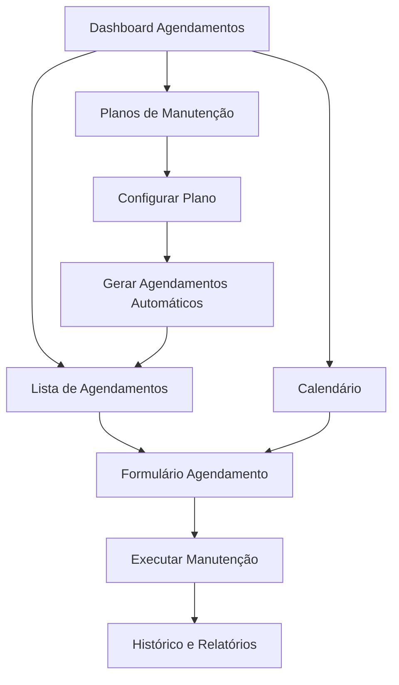

# Documento de Requisitos do Produto - Módulo de Agendamentos de Manutenção

## 1. Product Overview

O módulo de Agendamentos de Manutenção é um sistema completo para planejamento, execução e controle de manutenções preventivas em equipamentos hospitalares. Permite criar planos recorrentes, visualizar agendamentos em calendário e gerar automaticamente ordens de serviço.

* Soluciona o problema de falta de controle sistemático das manutenções preventivas, reduzindo falhas inesperadas e aumentando a vida útil dos equipamentos.

* Destinado a gestores de manutenção, técnicos e administradores hospitalares que precisam garantir o funcionamento contínuo dos equipamentos críticos.

## 2. Core Features

### 2.1 User Roles

| Role                 | Registration Method          | Core Permissions                                                                 |
| -------------------- | ---------------------------- | -------------------------------------------------------------------------------- |
| Administrador        | Acesso via sistema existente | Criar/editar planos, configurar notificações, visualizar todos os agendamentos   |
| Gestor de Manutenção | Acesso via sistema existente | Criar/editar agendamentos, aprovar execuções, gerar relatórios                   |
| Técnico              | Acesso via sistema existente | Visualizar agendamentos atribuídos, marcar como concluído, adicionar observações |

### 2.2 Feature Module

Nosso módulo de agendamentos consiste nas seguintes páginas principais:

1. **Dashboard de Agendamentos**: métricas principais, agendamentos vencidos, próximos vencimentos, gráficos de performance.
2. **Lista de Agendamentos**: visualização tabular com filtros, busca, paginação e ações rápidas.
3. **Calendário de Agendamentos**: visualização mensal/semanal dos agendamentos, arrastar e soltar para reagendar.
4. **Planos de Manutenção**: gerenciamento de templates reutilizáveis, configuração de frequências e tarefas.
5. **Formulário de Agendamento**: criação/edição de agendamentos individuais ou em lote.
6. **Histórico e Relatórios**: análise de performance, custos, tempo de execução e tendências.

### 2.3 Page Details

| Page Name                  | Module Name                | Feature description                                                                       |
| -------------------------- | -------------------------- | ----------------------------------------------------------------------------------------- |
| Dashboard de Agendamentos  | Métricas Principais        | Exibir KPIs: agendamentos pendentes, vencidos, concluídos no mês, taxa de cumprimento     |
| Dashboard de Agendamentos  | Alertas Críticos           | Mostrar agendamentos vencidos há mais de 7 dias, equipamentos críticos sem manutenção     |
| Dashboard de Agendamentos  | Gráficos de Tendência      | Visualizar evolução mensal de agendamentos, custos e tempo médio de execução              |
| Lista de Agendamentos      | Tabela Principal           | Listar agendamentos com colunas: equipamento, tipo, data, status, prioridade, responsável |
| Lista de Agendamentos      | Filtros Avançados          | Filtrar por equipamento, setor, status, prioridade, período, responsável                  |
| Lista de Agendamentos      | Ações em Lote              | Marcar múltiplos como concluído, reagendar em massa, exportar selecionados                |
| Calendário de Agendamentos | Visualização Mensal        | Mostrar agendamentos em calendário mensal com cores por prioridade                        |
| Calendário de Agendamentos | Arrastar e Soltar          | Permitir reagendamento através de drag-and-drop no calendário                             |
| Calendário de Agendamentos | Detalhes Rápidos           | Exibir popup com detalhes ao clicar no agendamento                                        |
| Planos de Manutenção       | Lista de Planos            | Gerenciar templates: nome, frequência, equipamentos, tarefas, status ativo/inativo        |
| Planos de Manutenção       | Configuração de Frequência | Definir intervalos: diário, semanal, mensal, trimestral, semestral, anual                 |
| Planos de Manutenção       | Tarefas do Plano           | Criar checklist de tarefas obrigatórias para cada tipo de manutenção                      |
| Formulário de Agendamento  | Dados Básicos              | Selecionar equipamento, plano de manutenção, data/hora, prioridade, responsável           |
| Formulário de Agendamento  | Agendamento Recorrente     | Configurar repetição automática baseada no plano selecionado                              |
| Formulário de Agendamento  | Validações                 | Verificar conflitos de horário, disponibilidade do responsável, pré-requisitos            |
| Histórico e Relatórios     | Histórico de Execução      | Listar manutenções concluídas com tempo real, custo, observações, fotos                   |
| Histórico e Relatórios     | Relatórios de Performance  | Gerar relatórios de cumprimento, custos, tempo médio, equipamentos críticos               |
| Histórico e Relatórios     | Exportação de Dados        | Exportar relatórios em PDF/Excel com filtros personalizados                               |

## 3. Core Process

### Fluxo Principal - Gestor de Manutenção:

1. Acessa o Dashboard para visualizar status geral dos agendamentos
2. Cria novos Planos de Manutenção definindo frequência e tarefas
3. Gera agendamentos automáticos baseados nos planos criados
4. Monitora execução através do Calendário e Lista de Agendamentos
5. Analisa performance através de Relatórios

### Fluxo Técnico:

1. Acessa Lista de Agendamentos filtrada por seus agendamentos
2. Visualiza detalhes e checklist de tarefas do agendamento
3. Executa manutenção seguindo o checklist
4. Marca agendamento como concluído com observações e fotos
5. Sistema gera automaticamente próximo agendamento se recorrente

### Fluxo Automático do Sistema:

1. Calcula próximas datas baseado na frequência dos planos
2. Cria agendamentos automaticamente 30 dias antes do vencimento
3. Envia notificações 7, 3 e 1 dia antes do vencimento
4. Escalona prioridade para agendamentos vencidos
5. Gera ordens de serviço automaticamente para agendamentos críticos

## 4. User Interface Design

### 4.1 Design Style

* **Cores primárias**: Azul (#3B82F6) para agendamentos normais, Verde (#10B981) para concluídos

* **Cores secundárias**: Vermelho (#EF4444) para vencidos, Amarelo (#F59E0B) para próximos ao vencimento

* **Estilo de botões**: Rounded corners (8px), com ícones descritivos

* **Fontes**: Inter 14px para texto normal, 16px para títulos, 12px para labels

* **Layout**: Card-based com sidebar de filtros, navegação por tabs

* **Ícones**: Lucide icons para calendário, relógio, ferramentas, alertas

### 4.2 Page Design Overview

| Page Name                  | Module Name         | UI Elements                                                                         |
| -------------------------- | ------------------- | ----------------------------------------------------------------------------------- |
| Dashboard de Agendamentos  | Métricas Principais | Cards com números grandes, ícones coloridos, gráficos de rosca para percentuais     |
| Dashboard de Agendamentos  | Alertas Críticos    | Lista com badges vermelhos, ícones de alerta, botões de ação rápida                 |
| Lista de Agendamentos      | Tabela Principal    | DataTable com sorting, badges de status coloridos, avatars para responsáveis        |
| Lista de Agendamentos      | Filtros             | Sidebar com selects, date pickers, checkboxes, botão "Limpar Filtros"               |
| Calendário de Agendamentos | Visualização Mensal | Calendário full-screen, eventos coloridos por prioridade, tooltips informativos     |
| Planos de Manutenção       | Lista de Planos     | Cards com preview das tarefas, toggle ativo/inativo, botões de edição               |
| Formulário de Agendamento  | Dados Básicos       | Form com 2 colunas, selects com busca, date/time pickers, textarea para observações |

### 4.3 Responsiveness

* **Desktop-first** com adaptação para tablets e mobile

* **Calendário responsivo**: Muda para visualização de lista em telas menores

* **Tabelas adaptáveis**: Colunas menos importantes ficam ocultas em mobile

* **Touch-friendly**: Botões com pelo menos 44px de altura, espaçamento adequado para toque

