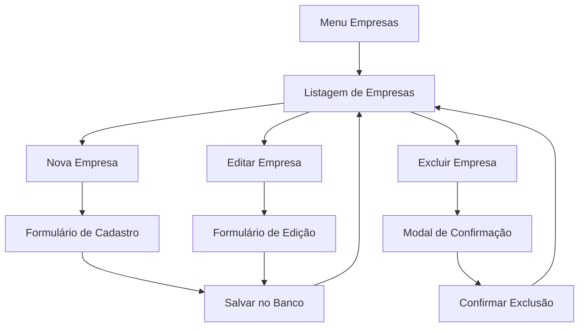

# Documento de Requisitos do Produto - Empresas Terceirizadas

## 1. Visão Geral do Produto

Sistema de gestão de empresas terceirizadas para o sistema de manutenção hospitalar, permitindo o cadastro, edição, listagem e gerenciamento completo de empresas prestadoras de serviços especializados.

- O sistema resolve a necessidade de centralizar informações de empresas terceirizadas que prestam serviços de manutenção hospitalar, facilitando o controle e comunicação.
- Destinado a administradores e técnicos do sistema de manutenção que precisam gerenciar fornecedores e prestadores de serviços.

## 2. Funcionalidades Principais

### 2.1 Papéis de Usuário

| Papel | Método de Registro | Permissões Principais |
|-------|-------------------|----------------------|
| Administrador | Login com credenciais administrativas | Pode criar, editar, visualizar e excluir empresas |
| Técnico | Login com credenciais de técnico | Pode visualizar e editar empresas |

### 2.2 Módulo de Funcionalidades

Nossos requisitos de empresas terceirizadas consistem nas seguintes páginas principais:

1. **Página de Listagem**: listagem de empresas, busca, filtros, paginação
2. **Formulário de Cadastro**: campos de entrada, validações, salvamento
3. **Formulário de Edição**: carregamento de dados, edição, atualização
4. **Modal de Confirmação**: confirmação de exclusão, feedback de ações

### 2.3 Detalhes das Páginas

| Nome da Página | Nome do Módulo | Descrição da Funcionalidade |
|----------------|----------------|----------------------------|
| Listagem de Empresas | Lista Principal | Exibir todas as empresas cadastradas em formato de cards ou tabela, com busca por nome/CNPJ, filtros por especialidade, paginação e botões de ação (editar/excluir) |
| Listagem de Empresas | Barra de Busca | Permitir busca em tempo real por nome da empresa ou CNPJ com resultados filtrados instantaneamente |
| Listagem de Empresas | Botão Nova Empresa | Abrir modal ou navegar para formulário de cadastro de nova empresa |
| Formulário de Cadastro | Campos de Entrada | Capturar Nome da Empresa, CNPJ (com máscara), Pessoa de Contato, Telefone (com máscara), E-mail, Endereço (textarea), Especialidades (textarea com exemplo) |
| Formulário de Cadastro | Validações | Validar CNPJ único e válido, e-mail válido, telefone no formato correto, campos obrigatórios preenchidos |
| Formulário de Cadastro | Botões de Ação | Salvar dados no banco MariaDB, cancelar e voltar à listagem, feedback de sucesso/erro |
| Formulário de Edição | Carregamento de Dados | Pré-popular formulário com dados existentes da empresa selecionada |
| Formulário de Edição | Atualização | Permitir edição de todos os campos e salvar alterações no banco de dados |
| Modal de Exclusão | Confirmação | Exibir modal de confirmação antes de excluir empresa, com nome da empresa e botões confirmar/cancelar |

## 3. Processo Principal

**Fluxo do Administrador:**
1. Acessa a página "Empresas" através do menu lateral
2. Visualiza lista de empresas cadastradas
3. Pode buscar empresas específicas ou filtrar por especialidade
4. Para cadastrar: clica em "Nova Empresa", preenche formulário e salva
5. Para editar: clica no botão editar da empresa, modifica dados e salva
6. Para excluir: clica no botão excluir, confirma ação no modal

**Fluxo do Técnico:**
1. Acessa a página "Empresas" através do menu lateral
2. Visualiza e busca empresas cadastradas
3. Pode editar informações de contato e especialidades das empresas

## 4. Design da Interface do Usuário

### 4.1 Estilo de Design

- **Cores Primárias**: Azul (#3B82F6) para botões principais, Vermelho (#EF4444) para ações de exclusão
- **Cores Secundárias**: Cinza (#6B7280) para textos secundários, Branco (#FFFFFF) para fundos
- **Estilo de Botões**: Arredondados (rounded-md), com hover effects e estados de loading
- **Fontes**: Inter ou system fonts, tamanhos 14px para textos, 16px para labels, 18px para títulos
- **Layout**: Design baseado em cards para listagem, formulários centralizados com máximo 600px de largura
- **Ícones**: Lucide React icons para consistência (Building2, Edit, Trash2, Plus)

### 4.2 Visão Geral do Design das Páginas

| Nome da Página | Nome do Módulo | Elementos da UI |
|----------------|----------------|-----------------|
| Listagem de Empresas | Header da Página | Título "Empresas Terceirizadas", botão azul "Nova Empresa" alinhado à direita |
| Listagem de Empresas | Barra de Busca | Input com ícone de lupa, placeholder "Buscar por nome ou CNPJ...", largura completa |
| Listagem de Empresas | Cards de Empresa | Cards brancos com sombra sutil, ícone Building2, nome em negrito, CNPJ, contato, telefone, especialidades truncadas, botões editar/excluir |
| Formulário de Cadastro | Modal/Página | Fundo semi-transparente, modal centralizado 600px, título "Nova Empresa", campos organizados em grid 2 colunas |
| Formulário de Cadastro | Campos de Input | Labels em cinza escuro, inputs com border cinza, focus em azul, máscaras automáticas para CNPJ/telefone |
| Formulário de Cadastro | Botões de Ação | "Cancelar" cinza à esquerda, "Criar" azul à direita, estados de loading com spinner |
| Formulário de Edição | Campos Pré-populados | Mesma estrutura do cadastro, mas com dados carregados, título "Editar Empresa" |
| Modal de Exclusão | Confirmação | Modal pequeno 400px, ícone de alerta vermelho, texto "Tem certeza que deseja excluir [Nome da Empresa]?", botões "Cancelar" e "Excluir" |

### 4.3 Responsividade

O sistema é desktop-first com adaptação para mobile. Em telas menores que 768px:
- Cards de empresa empilham verticalmente
- Formulários ocupam largura total com padding lateral
- Grid de campos muda para coluna única
- Botões de ação ficam empilhados verticalmente