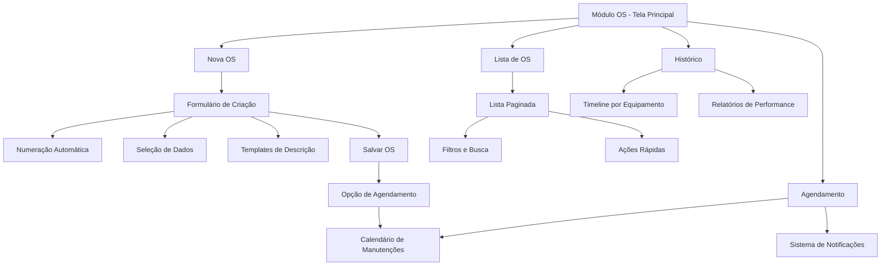

# PRD - Módulo de Ordem de Serviço Integrado

## 1. Product Overview

Sistema integrado de gestão de ordens de serviço para manutenção hospitalar, desenvolvido em uma única aba prática e intuitiva. O módulo permite criar, gerenciar e acompanhar ordens de serviço com numeração automática, controle de histórico e agendamento de manutenções futuras.

O sistema resolve a necessidade de centralizar todas as operações de manutenção em uma interface única, eliminando a fragmentação de processos e proporcionando maior eficiência operacional para equipes de manutenção hospitalar.

## 2. Core Features

### 2.1 User Roles

| Role | Registration Method | Core Permissions |
|------|---------------------|------------------|
| Técnico de Manutenção | Login com credenciais existentes | Criar e visualizar OS, atualizar status, adicionar observações |
| Supervisor de Manutenção | Login com credenciais existentes | Todas as permissões do técnico + aprovar OS de alto custo, gerenciar agendamentos |
| Administrador | Login com credenciais existentes | Acesso completo + configurar templates, gerenciar usuários, relatórios avançados |

### 2.2 Feature Module

O módulo de Ordem de Serviço consiste nas seguintes seções principais:

1. **Painel Principal**: formulário de criação/edição de OS, lista paginada de ordens, filtros e busca.
2. **Histórico de Manutenção**: visualização do histórico por equipamento, timeline de manutenções.
3. **Agendamento**: calendário de manutenções futuras, notificações automáticas.

### 2.3 Page Details

| Page Name | Module Name | Feature description |
|-----------|-------------|---------------------|
| Painel Principal | Formulário de OS | Criar nova OS com numeração automática (OS-XXX/YYYY), selecionar tipo de manutenção, empresa prestadora, equipamento, definir custo estimado, prioridade e descrição usando templates |
| Painel Principal | Lista de OS | Exibir ordens paginadas (10 por página), filtrar por status/prioridade/tipo, buscar por número ou equipamento, ações rápidas (editar, visualizar, excluir) |
| Painel Principal | Controle de Status | Atualizar status da OS (aberta, em andamento, concluída, cancelada), adicionar observações, registrar data de conclusão |
| Histórico de Manutenção | Timeline por Equipamento | Visualizar histórico completo de manutenções por equipamento, filtrar por período, exportar relatórios |
| Histórico de Manutenção | Indicadores de Performance | Mostrar métricas de tempo médio de resolução, custos acumulados, frequência de manutenções |
| Agendamento | Calendário de Manutenções | Agendar manutenções preventivas futuras, visualizar agenda mensal/semanal, arrastar e soltar para reagendar |
| Agendamento | Sistema de Notificações | Gerar alertas automáticos para manutenções vencidas, lembretes de agendamentos, notificações de atraso |

## 3. Core Process

### Fluxo Principal do Técnico de Manutenção:
1. Acessa o módulo de OS através do menu principal
2. Visualiza a lista de ordens pendentes na tela inicial
3. Clica em "Nova OS" para criar uma ordem de serviço
4. Preenche os dados obrigatórios: equipamento, empresa, tipo de manutenção, descrição
5. Sistema gera automaticamente o número da OS no formato OS-XXX/YYYY
6. Salva a OS e pode imediatamente agendar manutenção futura se necessário
7. Acompanha o progresso através da lista paginada e atualiza status conforme necessário

### Fluxo de Agendamento e Controle:
1. Supervisor acessa a aba de agendamento dentro do módulo
2. Visualiza calendário com manutenções programadas
3. Agenda novas manutenções preventivas diretamente no calendário
4. Sistema gera notificações automáticas para lembretes e atrasos
5. Equipe recebe alertas e executa manutenções conforme programado

## 4. User Interface Design

### 4.1 Design Style

- **Cores Primárias**: Azul hospitalar (#2563eb), Verde sucesso (#16a34a), Vermelho alerta (#dc2626)
- **Cores Secundárias**: Cinza neutro (#64748b), Branco (#ffffff), Cinza claro (#f1f5f9)
- **Estilo de Botões**: Arredondados (border-radius: 8px) com sombra sutil, efeito hover suave
- **Fonte**: Inter, tamanhos 14px (corpo), 16px (títulos), 12px (labels)
- **Layout**: Design em cards com navegação por abas horizontais, sidebar compacta
- **Ícones**: Lucide React com estilo outline, tamanho 20px para ações, 16px para status

### 4.2 Page Design Overview

| Page Name | Module Name | UI Elements |
|-----------|-------------|-------------|
| Painel Principal | Formulário de OS | Card principal com campos organizados em 2 colunas, botões de ação no rodapé, dropdown para templates, seletor de prioridade com cores visuais |
| Painel Principal | Lista de OS | Tabela responsiva com cabeçalhos fixos, badges coloridos para status, paginação inferior, barra de filtros superior com chips removíveis |
| Painel Principal | Barra de Filtros | Filtros inline com dropdowns, campo de busca com ícone de lupa, botão "Limpar filtros", contador de resultados |
| Histórico de Manutenção | Timeline | Cards verticais com linha temporal à esquerda, cores diferenciadas por tipo de manutenção, botões de expansão para detalhes |
| Histórico de Manutenção | Métricas | Cards de estatísticas com ícones, gráficos simples (barras/pizza), cores de destaque para KPIs importantes |
| Agendamento | Calendário | Vista mensal/semanal com eventos coloridos, modal para criação rápida, drag-and-drop para reagendamento |
| Agendamento | Notificações | Lista de alertas com ícones de prioridade, botões de ação (marcar como lido, adiar), timestamps relativos |

### 4.3 Responsiveness

O módulo é desenvolvido com abordagem mobile-first, adaptando-se automaticamente para tablets e desktops. Em dispositivos móveis, a navegação por abas se transforma em menu hambúrguer, e a tabela de OS utiliza cards empilhados. O calendário de agendamento adapta-se para vista de lista em telas pequenas, mantendo toda funcionalidade através de gestos touch otimizados.