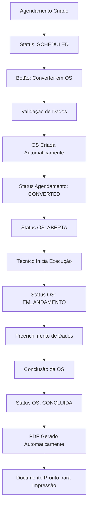

# Documento de Requisitos do Produto - Integração Agendamentos e Ordens de Serviço

## 1. Visão Geral do Produto

Sistema integrado que unifica o fluxo entre Agendamentos de Manutenção e Ordens de Serviço, eliminando duplicação de dados e criando um processo linear eficiente: **Agendamento → Ordem de Serviço → PDF Profissional**.

O sistema resolve o problema atual de sobreposição funcional entre as duas abas, criando um fluxo natural onde agendamentos são convertidos automaticamente em ordens de serviço executáveis, gerando documentos PDF completos e profissionais para impressão.

## 2. Funcionalidades Principais

### 2.1 Papéis de Usuário
| Papel | Método de Acesso | Permissões Principais |
|-------|------------------|----------------------|
| Técnico | Login padrão | Pode visualizar agendamentos, executar OS, preencher dados de execução |
| Supervisor | Login padrão | Pode converter agendamentos em OS, aprovar conclusões, gerar PDFs |
| Administrador | Login padrão | Acesso completo ao sistema, configurações de fluxo |

### 2.2 Módulos de Funcionalidade

Nossa solução integrada consiste nas seguintes páginas principais:

1. **Lista de Agendamentos**: visualização de agendamentos, botão "Converter em OS", filtros avançados
2. **Lista de Ordens de Serviço**: gerenciamento de OS ativas, controle de execução, geração de PDF
3. **Página de Execução**: formulário detalhado para preenchimento durante execução da manutenção
4. **Visualização de PDF**: preview e download do documento final completo

### 2.3 Detalhes das Páginas

| Nome da Página | Nome do Módulo | Descrição da Funcionalidade |
|----------------|----------------|----------------------------|
| Lista de Agendamentos | Botão Converter OS | Adicionar botão "🔄 Converter em OS" para agendamentos com status SCHEDULED. Validar dados obrigatórios antes da conversão |
| Lista de Agendamentos | Status Integrado | Exibir novos status: SCHEDULED, CONVERTED, CANCELLED com cores diferenciadas |
| Lista de Ordens de Serviço | Origem do Agendamento | Mostrar dados do agendamento original (data programada, técnico designado) em cada OS |
| Página de Execução | Formulário Completo | Campos para tempo real gasto, peças utilizadas, observações técnicas, fotos, custos finais |
| Página de Execução | Validação de Conclusão | Verificar preenchimento obrigatório antes de marcar como concluída |
| Visualização de PDF | Documento Integrado | Gerar PDF com seção de agendamento + seção de execução + assinaturas |
| Dashboard | Métricas Unificadas | KPIs que consideram todo o fluxo: agendamentos → conversões → conclusões |

## 3. Fluxo Principal do Processo

### Fluxo do Usuário Supervisor:
1. Acessa Lista de Agendamentos
2. Identifica agendamento pronto para execução
3. Clica em "Converter em OS"
4. Sistema valida dados e cria OS automaticamente
5. Agendamento fica com status "CONVERTIDO"
6. OS aparece na lista com status "ABERTA"

### Fluxo do Técnico:
1. Acessa Lista de Ordens de Serviço
2. Seleciona OS para execução
3. Clica em "Iniciar Execução"
4. Preenche dados em tempo real
5. Finaliza com "Concluir OS"
6. Sistema gera PDF automaticamente

## 4. Design da Interface do Usuário

### 4.1 Estilo de Design
- **Cores Primárias**: Azul (#3B82F6) para ações principais, Verde (#10B981) para conclusões
- **Cores Secundárias**: Laranja (#F59E0B) para conversões, Vermelho (#EF4444) para alertas
- **Estilo de Botões**: Arredondados com ícones, efeito hover suave
- **Fontes**: Inter 14px para textos, Inter 16px Bold para títulos
- **Layout**: Cards com sombra suave, espaçamento de 16px entre elementos
- **Ícones**: Lucide React com estilo outline, tamanho 16px

### 4.2 Visão Geral do Design das Páginas

| Nome da Página | Nome do Módulo | Elementos da UI |
|----------------|----------------|-----------------|
| Lista de Agendamentos | Botão Converter OS | Botão azul com ícone 🔄, posicionado na coluna Ações, tooltip explicativo |
| Lista de Agendamentos | Status Visual | Badges coloridos: SCHEDULED (azul), CONVERTED (verde), CANCELLED (vermelho) |
| Lista de OS | Card de Origem | Card cinza claro mostrando "Originado do Agendamento #123 - 15/01/2024" |
| Página de Execução | Formulário em Etapas | Wizard com 3 etapas: Início, Execução, Finalização. Progress bar no topo |
| Visualização PDF | Preview Integrado | Modal fullscreen com preview do PDF, botões Download e Imprimir |

### 4.3 Responsividade
Sistema desktop-first com adaptação para tablets. Interface otimizada para uso em computadores durante execução de manutenções, com suporte a touch para assinatura digital em tablets.