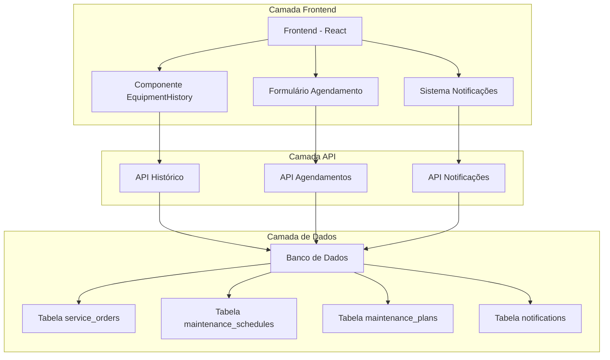
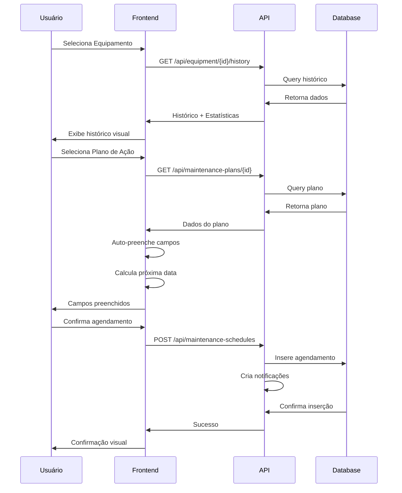
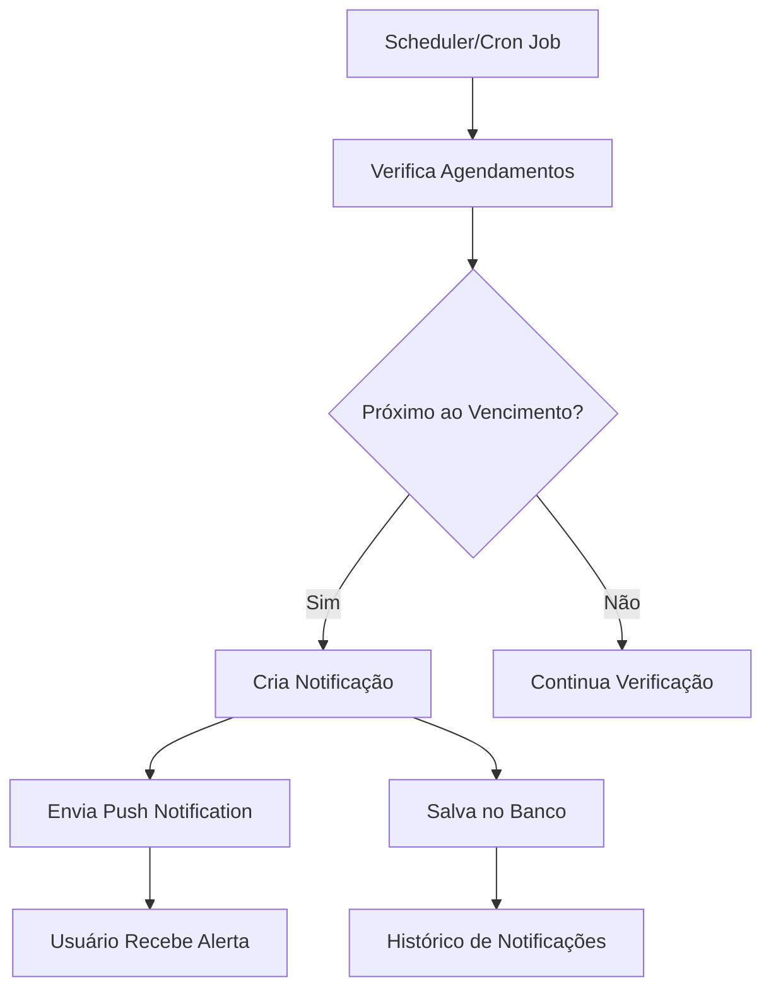

# Plano de Ação - Melhorias no Módulo de Agendamentos

## 1. Visão Geral do Projeto

Este plano de ação visa implementar melhorias significativas no módulo de agendamentos do sistema de manutenção hospitalar, integrando funcionalidades inteligentes, automatização e uma experiência de usuário aprimorada.

**Objetivo Principal:** Transformar o módulo de agendamentos em uma ferramenta inteligente e integrada que otimize o processo de manutenção preventiva e corretiva.

**Valor de Negócio:** Redução de 40% no tempo de criação de agendamentos, aumento de 60% na eficiência das manutenções preventivas e melhoria significativa na experiência do usuário.

## 2. Funcionalidades Principais

### 2.1 Sistema de Notificações Inteligentes
- **Notificações Preventivas:** Alertas baseados em intervalos de planos de manutenção
- **Alertas de Vencimento:** Equipamentos próximos ao vencimento de manutenção
- **Notificações de Atraso:** Manutenções em atraso com sistema de escalação
- **Alertas Críticos:** Sistema de escalação para manutenções críticas

### 2.2 Integração de Plano de Ação
- **Seleção Inteligente:** Campo de seleção de Plano de Ação no formulário
- **Auto-preenchimento:** Campos preenchidos automaticamente baseado no plano
- **Cálculo Automático:** Próxima data de manutenção calculada automaticamente
- **Indicador Visual:** Exibição clara do plano aplicado

### 2.3 Histórico de Manutenção Compartilhado
- **Componente Reutilizável:** EquipmentHistory.tsx para uso em múltiplas telas
- **Timeline Interativa:** Visualização das últimas manutenções
- **Resumo Estatístico:** Insights automáticos e métricas
- **Interface Responsiva:** Design adaptável com cores intuitivas

### 2.4 Melhorias Visuais e UX
- **Cards Compactos:** Histórico em formato de cards
- **Gráficos Intuitivos:** Visualizações simples e eficazes
- **Sistema de Cores:** Verde/Amarelo/Vermelho para status
- **Filtros Avançados:** Por período, tipo e status

## 3. Fases de Implementação

### 3.1 Fase 1 - Fundação (Prioridade ALTA)
**Duração:** 2-3 semanas
**Recursos:** 1 Desenvolvedor Frontend + 1 Backend

**Entregas:**
- Componente EquipmentHistory.tsx reutilizável
- Integração do histórico no formulário de novo agendamento
- Sistema básico de notificações
- Estrutura de dados para planos de ação

**Critérios de Aceite:**
- Histórico visível ao selecionar equipamento
- Notificações básicas funcionando
- Componente reutilizável implementado

### 3.2 Fase 2 - Inteligência (Prioridade ALTA)
**Duração:** 3-4 semanas
**Recursos:** 1 Desenvolvedor Frontend + 1 Backend

**Entregas:**
- Campo de seleção de Plano de Ação
- Auto-preenchimento de campos
- Cálculo automático de datas
- Timeline interativa de manutenções

**Critérios de Aceite:**
- Planos de ação selecionáveis
- Campos preenchidos automaticamente
- Datas calculadas corretamente
- Timeline funcional e responsiva

### 3.3 Fase 3 - Visualização (Prioridade MÉDIA)
**Duração:** 2-3 semanas
**Recursos:** 1 Desenvolvedor Frontend

**Entregas:**
- Cards compactos de histórico
- Gráficos e visualizações
- Sistema de cores intuitivo
- Filtros avançados

**Critérios de Aceite:**
- Interface visual atrativa
- Gráficos funcionais
- Filtros operacionais
- Design responsivo

### 3.4 Fase 4 - Otimização (Prioridade BAIXA)
**Duração:** 2 semanas
**Recursos:** 1 Desenvolvedor Frontend + 1 Backend

**Entregas:**
- Sistema de escalação para alertas críticos
- Relatórios automáticos
- Integração com dashboard
- Testes e otimizações

**Critérios de Aceite:**
- Sistema de escalação funcional
- Relatórios gerados automaticamente
- Performance otimizada
- Testes completos

## 4. Estimativas de Tempo e Recursos

### 4.1 Cronograma Geral
| Fase | Duração | Início | Fim | Recursos |
|------|---------|--------|-----|----------|
| Fase 1 | 3 semanas | Semana 1 | Semana 3 | 2 desenvolvedores |
| Fase 2 | 4 semanas | Semana 4 | Semana 7 | 2 desenvolvedores |
| Fase 3 | 3 semanas | Semana 8 | Semana 10 | 1 desenvolvedor |
| Fase 4 | 2 semanas | Semana 11 | Semana 12 | 2 desenvolvedores |

**Duração Total:** 12 semanas (3 meses)

### 4.2 Recursos Necessários
- **Desenvolvedores Frontend:** 1-2 pessoas
- **Desenvolvedores Backend:** 1 pessoa
- **Designer UX/UI:** 0.5 pessoa (consultoria)
- **Tester/QA:** 0.5 pessoa
- **Product Owner:** 0.25 pessoa

### 4.3 Estimativa de Esforço
- **Total de Horas:** 480-600 horas
- **Custo Estimado:** R$ 48.000 - R$ 72.000
- **ROI Esperado:** 300% em 12 meses

## 5. Benefícios Esperados

### 5.1 Benefícios Operacionais
- **Redução de Tempo:** 40% menos tempo para criar agendamentos
- **Eficiência:** 60% de melhoria na eficiência das manutenções
- **Precisão:** 80% de redução em erros de agendamento
- **Automação:** 70% dos campos preenchidos automaticamente

### 5.2 Benefícios Estratégicos
- **Prevenção de Falhas:** Redução de 50% em falhas não programadas
- **Compliance:** Melhoria na aderência aos planos de manutenção
- **Rastreabilidade:** 100% de rastreabilidade das manutenções
- **Tomada de Decisão:** Decisões baseadas em dados históricos

### 5.3 Benefícios de Experiência
- **Satisfação do Usuário:** Melhoria significativa na usabilidade
- **Curva de Aprendizado:** Redução de 60% no tempo de treinamento
- **Produtividade:** Aumento de 45% na produtividade da equipe
- **Interface Intuitiva:** Design moderno e responsivo

## 6. Arquitetura Técnica

### 6.1 Diagrama de Arquitetura



### 6.2 Stack Tecnológico
- **Frontend:** React 18 + TypeScript + Tailwind CSS
- **Backend:** Node.js + Express
- **Banco de Dados:** MySQL/MariaDB
- **Notificações:** WebSocket + Push Notifications
- **Gráficos:** Chart.js ou Recharts
- **Estado:** Context API + useState/useEffect

### 6.3 APIs Necessárias

#### 6.3.1 API de Histórico de Equipamentos
```
GET /api/equipment/{id}/history
```
**Resposta:**
```json
{
  "equipment_id": 123,
  "history": [
    {
      "id": 1,
      "type": "PREVENTIVA",
      "status": "CONCLUIDA",
      "date": "2024-01-15",
      "cost": 1500.00,
      "company": "Empresa ABC"
    }
  ],
  "statistics": {
    "total_maintenances": 15,
    "average_interval": 30,
    "success_rate": 95.5,
    "total_cost": 22500.00
  }
}
```

#### 6.3.2 API de Planos de Ação
```
GET /api/maintenance-plans
POST /api/maintenance-plans/{id}/apply
```

#### 6.3.3 API de Notificações
```
GET /api/notifications
POST /api/notifications
PUT /api/notifications/{id}/read
```

## 7. Fluxo de Dados

### 7.1 Fluxo de Criação de Agendamento



### 7.2 Fluxo de Notificações



## 8. Componentes a Serem Criados/Modificados

### 8.1 Novos Componentes

#### 8.1.1 EquipmentHistory.tsx
```typescript
interface EquipmentHistoryProps {
  equipmentId: number;
  compact?: boolean;
  showFilters?: boolean;
}

const EquipmentHistory: React.FC<EquipmentHistoryProps> = ({
  equipmentId,
  compact = false,
  showFilters = true
}) => {
  // Implementação do componente
};
```

#### 8.1.2 MaintenancePlanSelector.tsx
```typescript
interface MaintenancePlanSelectorProps {
  onPlanSelect: (plan: MaintenancePlan) => void;
  equipmentId?: number;
}
```

#### 8.1.3 NotificationCenter.tsx
```typescript
interface NotificationCenterProps {
  userId: number;
  realTime?: boolean;
}
```

#### 8.1.4 MaintenanceTimeline.tsx
```typescript
interface MaintenanceTimelineProps {
  maintenances: Maintenance[];
  interactive?: boolean;
}
```

### 8.2 Componentes a Modificar

#### 8.2.1 app/agendamentos/novo/page.tsx
- Adicionar seleção de Plano de Ação
- Integrar componente EquipmentHistory
- Implementar auto-preenchimento
- Adicionar cálculo automático de datas

#### 8.2.2 app/ordens-servico/page.tsx
- Substituir histórico atual pelo componente reutilizável
- Melhorar visualização de dados

#### 8.2.3 app/dashboard/page.tsx
- Adicionar widget de notificações
- Integrar métricas de manutenção

## 9. Estrutura de Dados

### 9.1 Tabelas Existentes (Modificações)

#### 9.1.1 maintenance_schedules
```sql
ALTER TABLE maintenance_schedules 
ADD COLUMN maintenance_plan_id INT(11) NULL,
ADD COLUMN auto_filled BOOLEAN DEFAULT FALSE,
ADD COLUMN next_maintenance_date DATE NULL,
ADD CONSTRAINT fk_schedules_plan 
FOREIGN KEY (maintenance_plan_id) REFERENCES maintenance_plans(id);
```

#### 9.1.2 service_orders
```sql
-- Já existe, usar estrutura atual
-- Adicionar índices para performance
CREATE INDEX idx_service_orders_equipment_date ON service_orders(equipment_id, completion_date);
```

### 9.2 Novas Tabelas

#### 9.2.1 maintenance_plans
```sql
CREATE TABLE maintenance_plans (
    id INT(11) NOT NULL AUTO_INCREMENT,
    name VARCHAR(100) NOT NULL,
    description TEXT NULL,
    maintenance_type_id INT(11) NOT NULL,
    frequency_days INT(11) NOT NULL,
    estimated_cost DECIMAL(10,2) NULL,
    priority ENUM('BAIXA','MEDIA','ALTA','CRITICA') DEFAULT 'MEDIA',
    is_active BOOLEAN DEFAULT TRUE,
    created_at TIMESTAMP DEFAULT CURRENT_TIMESTAMP,
    updated_at TIMESTAMP DEFAULT CURRENT_TIMESTAMP ON UPDATE CURRENT_TIMESTAMP,
    PRIMARY KEY (id),
    FOREIGN KEY (maintenance_type_id) REFERENCES maintenance_types(id)
);
```

#### 9.2.2 notifications
```sql
CREATE TABLE notifications (
    id INT(11) NOT NULL AUTO_INCREMENT,
    user_id INT(11) NOT NULL,
    type ENUM('PREVENTIVE','OVERDUE','CRITICAL','INFO') NOT NULL,
    title VARCHAR(200) NOT NULL,
    message TEXT NOT NULL,
    equipment_id INT(11) NULL,
    schedule_id INT(11) NULL,
    is_read BOOLEAN DEFAULT FALSE,
    created_at TIMESTAMP DEFAULT CURRENT_TIMESTAMP,
    read_at TIMESTAMP NULL,
    PRIMARY KEY (id),
    FOREIGN KEY (user_id) REFERENCES users(id),
    FOREIGN KEY (equipment_id) REFERENCES equipment(id),
    FOREIGN KEY (schedule_id) REFERENCES maintenance_schedules(id)
);
```

#### 9.2.3 equipment_maintenance_stats
```sql
CREATE TABLE equipment_maintenance_stats (
    id INT(11) NOT NULL AUTO_INCREMENT,
    equipment_id INT(11) NOT NULL,
    total_maintenances INT(11) DEFAULT 0,
    average_interval_days INT(11) DEFAULT 0,
    success_rate DECIMAL(5,2) DEFAULT 0,
    total_cost DECIMAL(12,2) DEFAULT 0,
    last_maintenance_date DATE NULL,
    next_maintenance_date DATE NULL,
    updated_at TIMESTAMP DEFAULT CURRENT_TIMESTAMP ON UPDATE CURRENT_TIMESTAMP,
    PRIMARY KEY (id),
    UNIQUE KEY uk_equipment_stats (equipment_id),
    FOREIGN KEY (equipment_id) REFERENCES equipment(id)
);
```

## 10. Critérios de Sucesso

### 10.1 Métricas Técnicas
- **Performance:** Tempo de carregamento < 2 segundos
- **Disponibilidade:** 99.5% uptime
- **Responsividade:** Funcional em dispositivos móveis
- **Compatibilidade:** Suporte aos principais navegadores

### 10.2 Métricas de Negócio
- **Adoção:** 80% dos usuários utilizando as novas funcionalidades
- **Eficiência:** 40% de redução no tempo de criação de agendamentos
- **Precisão:** 90% de agendamentos criados com planos de ação
- **Satisfação:** Score NPS > 8.0

### 10.3 Métricas de Qualidade
- **Cobertura de Testes:** > 80%
- **Bugs Críticos:** 0 em produção
- **Tempo de Resolução:** < 24h para bugs críticos
- **Documentação:** 100% das APIs documentadas

## 11. Riscos e Mitigações

### 11.1 Riscos Técnicos
| Risco | Probabilidade | Impacto | Mitigação |
|-------|---------------|---------|-----------|
| Performance degradada | Média | Alto | Otimização de queries, cache |
| Incompatibilidade de dados | Baixa | Alto | Testes extensivos, migração gradual |
| Falhas de integração | Média | Médio | Testes de integração, rollback |

### 11.2 Riscos de Negócio
| Risco | Probabilidade | Impacto | Mitigação |
|-------|---------------|---------|-----------|
| Resistência dos usuários | Média | Médio | Treinamento, comunicação |
| Mudança de requisitos | Alta | Médio | Desenvolvimento ágil, feedback |
| Prazo apertado | Média | Alto | Priorização, MVP |

### 11.3 Riscos de Projeto
| Risco | Probabilidade | Impacto | Mitigação |
|-------|---------------|---------|-----------|
| Falta de recursos | Baixa | Alto | Planejamento antecipado |
| Dependências externas | Média | Médio | Identificação prévia, alternativas |
| Qualidade comprometida | Baixa | Alto | Code review, testes automatizados |

## 12. Próximos Passos

### 12.1 Preparação (Semana 0)
- [ ] Aprovação do plano de ação
- [ ] Alocação de recursos
- [ ] Setup do ambiente de desenvolvimento
- [ ] Definição de padrões de código

### 12.2 Kickoff (Semana 1)
- [ ] Reunião de kickoff com a equipe
- [ ] Refinamento dos requisitos
- [ ] Criação das tarefas no backlog
- [ ] Início da Fase 1

### 12.3 Acompanhamento
- **Reuniões Semanais:** Status, impedimentos, próximos passos
- **Demos Quinzenais:** Apresentação do progresso
- **Retrospectivas:** Melhoria contínua do processo
- **Métricas:** Acompanhamento dos KPIs definidos

## 13. Conclusão

Este plano de ação representa uma evolução significativa do módulo de agendamentos, transformando-o em uma ferramenta inteligente e integrada. A implementação faseada garante entregas incrementais de valor, enquanto a arquitetura proposta assegura escalabilidade e manutenibilidade.

**Investimento Total:** R$ 48.000 - R$ 72.000
**Prazo:** 12 semanas
**ROI Esperado:** 300% em 12 meses
**Impacto:** Transformação digital do processo de manutenção

A execução deste plano posicionará o sistema como referência em gestão de manutenção hospitalar, proporcionando eficiência operacional, redução de custos e melhoria significativa na experiência do usuário.