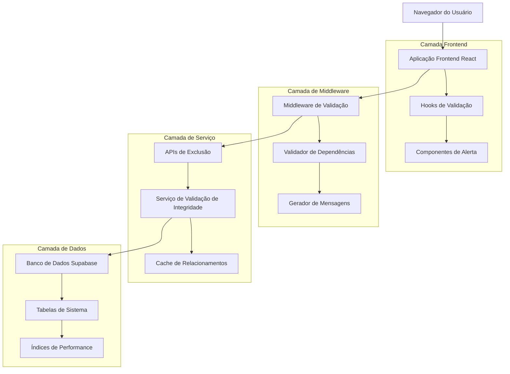
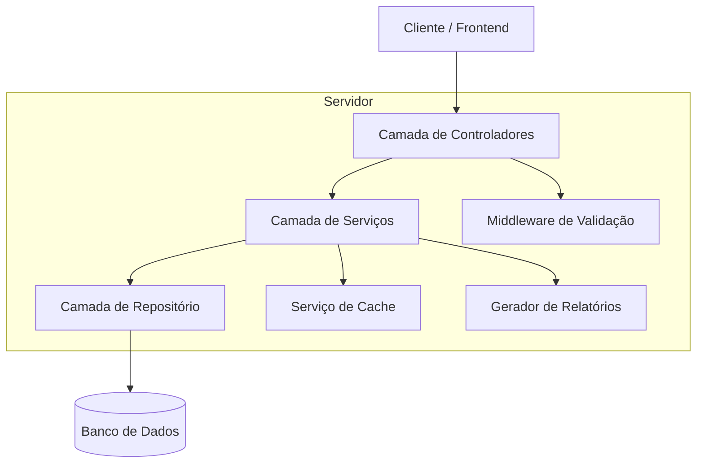
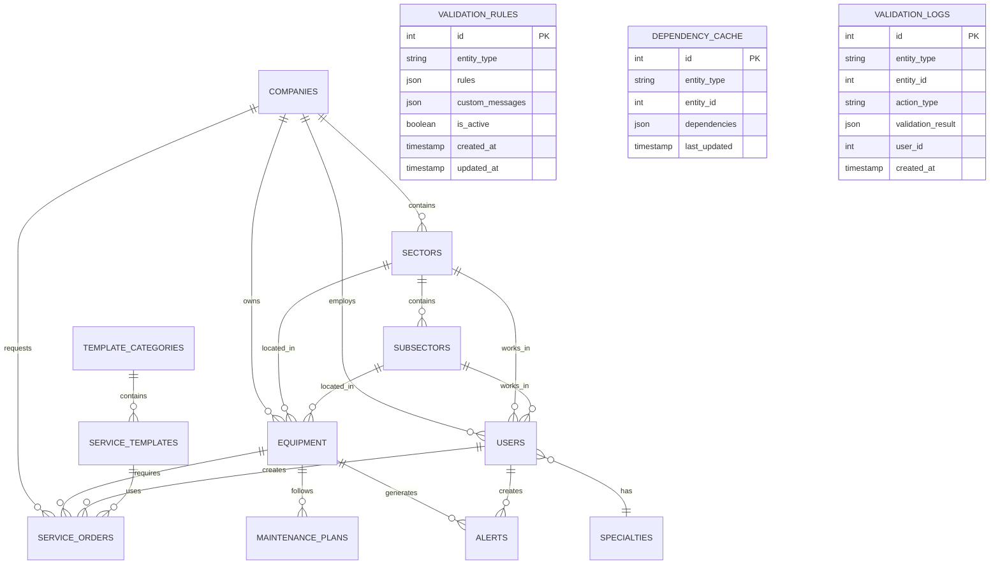

# Arquitetura Técnica - Sistema de Validação de Integridade Referencial

## 1. Design da Arquitetura



## 2. Descrição da Tecnologia

* **Frontend**: React\@18 + TypeScript + TailwindCSS\@3 + Vite

* **Backend**: Next.js API Routes + Middleware personalizado

* **Banco de Dados**: Supabase (PostgreSQL)

* **Notificações**: Sonner (toast notifications)

* **Validação**: Zod para schemas de validação

* **Cache**: React Query para cache de dependências

## 3. Definições de Rotas

| Rota                                  | Propósito                                    |
| ------------------------------------- | -------------------------------------------- |
| /validacao                            | Painel principal de validação de integridade |
| /validacao/configuracoes              | Configurações de regras de validação         |
| /validacao/relatorios                 | Relatórios de dependências e tentativas      |
| /validacao/dependencias/:entidade/:id | Visualizador de dependências específicas     |

## 4. Definições de API

### 4.1 APIs Principais

**Validação de integridade antes da exclusão**

```
POST /api/validation/check-dependencies
```

Request:

| Nome do Parâmetro | Tipo do Parâmetro | Obrigatório | Descrição                                              |
| ----------------- | ----------------- | ----------- | ------------------------------------------------------ |
| entityType        | string            | true        | Tipo da entidade (companies, sectors, equipment, etc.) |
| entityId          | number            | true        | ID da entidade a ser excluída                          |
| includeDetails    | boolean           | false       | Se deve incluir detalhes dos registros vinculados      |

Response:

| Nome do Parâmetro | Tipo do Parâmetro | Descrição                         |
| ----------------- | ----------------- | --------------------------------- |
| canDelete         | boolean           | Se a exclusão é permitida         |
| dependencies      | array             | Lista de dependências encontradas |
| totalCount        | number            | Total de registros vinculados     |
| suggestions       | array             | Sugestões de ações alternativas   |

Exemplo:

```json
{
  "entityType": "companies",
  "entityId": 123,
  "includeDetails": true
}
```

**Obter detalhes de dependências**

```
GET /api/validation/dependencies/:entityType/:id
```

Request:

| Nome do Parâmetro | Tipo do Parâmetro | Obrigatório | Descrição                      |
| ----------------- | ----------------- | ----------- | ------------------------------ |
| entityType        | string            | true        | Tipo da entidade               |
| id                | number            | true        | ID da entidade                 |
| page              | number            | false       | Página para paginação          |
| limit             | number            | false       | Limite de registros por página |

Response:

| Nome do Parâmetro | Tipo do Parâmetro | Descrição                         |
| ----------------- | ----------------- | --------------------------------- |
| dependencies      | array             | Lista detalhada de dependências   |
| pagination        | object            | Informações de paginação          |
| entityInfo        | object            | Informações da entidade principal |

**Configurar regras de validação**

```
PUT /api/validation/rules
```

Request:

| Nome do Parâmetro | Tipo do Parâmetro | Obrigatório | Descrição                          |
| ----------------- | ----------------- | ----------- | ---------------------------------- |
| entityType        | string            | true        | Tipo da entidade                   |
| rules             | object            | true        | Regras de validação personalizadas |
| messages          | object            | false       | Mensagens personalizadas           |

Response:

| Nome do Parâmetro | Tipo do Parâmetro | Descrição          |
| ----------------- | ----------------- | ------------------ |
| success           | boolean           | Status da operação |
| updatedRules      | object            | Regras atualizadas |

## 5. Arquitetura do Servidor



## 6. Modelo de Dados

### 6.1 Definição do Modelo de Dados



### 6.2 Linguagem de Definição de Dados

**Tabela de Regras de Validação (validation\_rules)**

```sql
-- Criar tabela
CREATE TABLE validation_rules (
    id UUID PRIMARY KEY DEFAULT gen_random_uuid(),
    entity_type VARCHAR(50) NOT NULL,
    rules JSONB NOT NULL DEFAULT '{}',
    custom_messages JSONB DEFAULT '{}',
    is_active BOOLEAN DEFAULT true,
    created_at TIMESTAMP WITH TIME ZONE DEFAULT NOW(),
    updated_at TIMESTAMP WITH TIME ZONE DEFAULT NOW()
);

-- Criar índices
CREATE INDEX idx_validation_rules_entity_type ON validation_rules(entity_type);
CREATE INDEX idx_validation_rules_active ON validation_rules(is_active);

-- Dados iniciais
INSERT INTO validation_rules (entity_type, rules, custom_messages) VALUES
('companies', '{"check_sectors": true, "check_equipment": true, "check_users": true, "check_service_orders": true}', '{"sectors": "Esta empresa possui {count} setores vinculados", "equipment": "Esta empresa possui {count} equipamentos vinculados"}'),
('sectors', '{"check_subsectors": true, "check_equipment": true, "check_users": true}', '{"subsectors": "Este setor possui {count} subsetores vinculados", "equipment": "Este setor possui {count} equipamentos vinculados"}'),
('template_categories', '{"check_service_templates": true}', '{"service_templates": "Esta categoria possui {count} templates de serviço vinculados"}');
```

**Tabela de Cache de Dependências (dependency\_cache)**

```sql
-- Criar tabela
CREATE TABLE dependency_cache (
    id UUID PRIMARY KEY DEFAULT gen_random_uuid(),
    entity_type VARCHAR(50) NOT NULL,
    entity_id INTEGER NOT NULL,
    dependencies JSONB NOT NULL DEFAULT '[]',
    last_updated TIMESTAMP WITH TIME ZONE DEFAULT NOW()
);

-- Criar índices
CREATE UNIQUE INDEX idx_dependency_cache_entity ON dependency_cache(entity_type, entity_id);
CREATE INDEX idx_dependency_cache_updated ON dependency_cache(last_updated);

-- Configurar TTL para cache (opcional)
CREATE OR REPLACE FUNCTION cleanup_old_cache() RETURNS void AS $$
BEGIN
    DELETE FROM dependency_cache WHERE last_updated < NOW() - INTERVAL '1 hour';
END;
$$ LANGUAGE plpgsql;
```

**Tabela de Logs de Validação (validation\_logs)**

```sql
-- Criar tabela
CREATE TABLE validation_logs (
    id UUID PRIMARY KEY DEFAULT gen_random_uuid(),
    entity_type VARCHAR(50) NOT NULL,
    entity_id INTEGER NOT NULL,
    action_type VARCHAR(20) NOT NULL CHECK (action_type IN ('delete_attempt', 'validation_check', 'rule_update')),
    validation_result JSONB NOT NULL,
    user_id UUID,
    created_at TIMESTAMP WITH TIME ZONE DEFAULT NOW()
);

-- Criar índices
CREATE INDEX idx_validation_logs_entity ON validation_logs(entity_type, entity_id);
CREATE INDEX idx_validation_logs_created_at ON validation_logs(created_at DESC);
CREATE INDEX idx_validation_logs_user ON validation_logs(user_id);

-- Configurar permissões Supabase
GRANT SELECT ON validation_rules TO anon;
GRANT ALL PRIVILEGES ON validation_rules TO authenticated;

GRANT SELECT ON dependency_cache TO anon;
GRANT ALL PRIVILEGES ON dependency_cache TO authenticated;

GRANT SELECT ON validation_logs TO anon;
GRANT ALL PRIVILEGES ON validation_logs TO authenticated;
```

**Relacionamentos Principais do Sistema**

```sql
-- Mapeamento de relacionamentos para validação automática
CREATE TABLE entity_relationships (
    id UUID PRIMARY KEY DEFAULT gen_random_uuid(),
    parent_entity VARCHAR(50) NOT NULL,
    child_entity VARCHAR(50) NOT NULL,
    foreign_key_column VARCHAR(50) NOT NULL,
    relationship_type VARCHAR(20) DEFAULT 'one_to_many',
    is_active BOOLEAN DEFAULT true
);

-- Dados iniciais de relacionamentos
INSERT INTO entity_relationships (parent_entity, child_entity, foreign_key_column) VALUES
('companies', 'sectors', 'company_id'),
('companies', 'equipment', 'company_id'),
('companies', 'users', 'company_id'),
('companies', 'service_orders', 'company_id'),
('sectors', 'subsectors', 'sector_id'),
('sectors', 'equipment', 'sector_id'),
('sectors', 'users', 'sector_id'),
('subsectors', 'equipment', 'subsector_id'),
('subsectors', 'users', 'subsector_id'),
('equipment', 'service_orders', 'equipment_id'),
('equipment', 'maintenance_plans', 'equipment_id'),
('equipment', 'alerts', 'equipment_id'),
('users', 'service_orders', 'created_by'),
('users', 'alerts', 'created_by'),
('template_categories', 'service_templates', 'category_id'),
('service_templates', 'service_orders', 'template_id');
```

