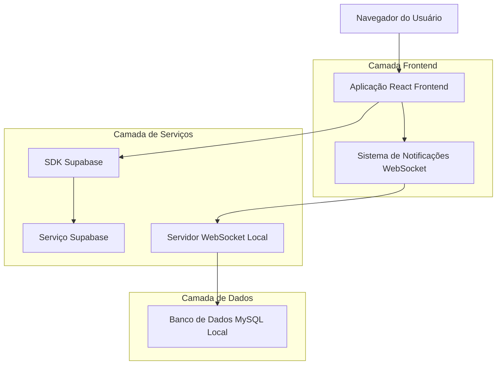
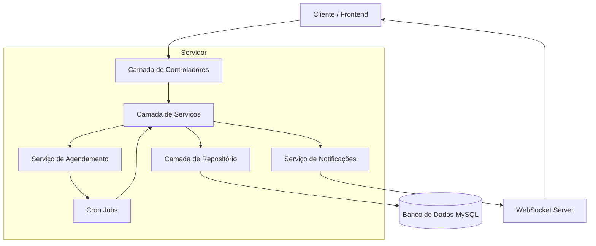
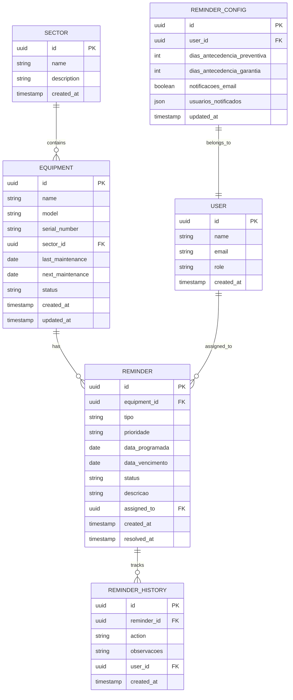

# Sistema de Lembretes de Manutenção - Documento de Arquitetura Técnica

## 1. Design da Arquitetura



## 2. Descrição das Tecnologias

* Frontend: React\@18 + TypeScript + Tailwind CSS\@3 + Next.js\@14

* Backend: Node.js + Express (para WebSocket e integrações)

* Banco de Dados: MySQL (local) + Supabase (autenticação e dados auxiliares)

* Notificações: WebSocket personalizado + Sistema de lembretes automáticos

* UI Components: Shadcn/ui + Lucide React Icons

## 3. Definições de Rotas

| Rota                         | Propósito                                                   |
| ---------------------------- | ----------------------------------------------------------- |
| /lembretes                   | Dashboard principal de lembretes com resumo e ações rápidas |
| /lembretes/preventiva        | Lista de equipamentos próximos da manutenção preventiva     |
| /lembretes/em-manutencao     | Controle de equipamentos atualmente em manutenção           |
| /lembretes/historico         | Histórico completo de lembretes resolvidos e relatórios     |
| /lembretes/configuracoes     | Configurações de prazos, notificações e personalização      |
| /lembretes/equipamento/\[id] | Detalhes específicos de lembretes de um equipamento         |

## 4. Definições de API

### 4.1 APIs Principais

**Lembretes de Manutenção Preventiva**

```
GET /api/lembretes/preventiva
```

Request:

| Nome do Parâmetro  | Tipo   | Obrigatório | Descrição                                               |
| ------------------ | ------ | ----------- | ------------------------------------------------------- |
| dias\_antecedencia | number | false       | Número de dias de antecedência para filtrar (padrão: 7) |
| setor\_id          | string | false       | ID do setor para filtrar equipamentos                   |
| prioridade         | string | false       | Filtro por prioridade (baixa, media, alta, critica)     |

Response:

| Nome do Parâmetro | Tipo   | Descrição                                   |
| ----------------- | ------ | ------------------------------------------- |
| lembretes         | array  | Lista de lembretes de manutenção preventiva |
| total             | number | Total de lembretes encontrados              |

Exemplo:

```json
{
  "lembretes": [
    {
      "id": "uuid",
      "equipment_id": "eq_001",
      "equipment_name": "Compressor AR-01",
      "tipo_manutencao": "preventiva",
      "data_programada": "2024-01-15",
      "dias_restantes": 3,
      "prioridade": "alta",
      "setor": "Produção",
      "descricao": "Manutenção preventiva trimestral",
      "status": "pendente"
    }
  ],
  "total": 15
}
```

**Controle de Equipamentos em Manutenção**

```
GET /api/lembretes/em-manutencao
```

Request:

| Nome do Parâmetro | Tipo   | Obrigatório | Descrição                                                           |
| ----------------- | ------ | ----------- | ------------------------------------------------------------------- |
| status            | string | false       | Status do equipamento (em\_manutencao, atrasado, aguardando\_pecas) |
| dias\_atraso      | number | false       | Filtrar por dias de atraso mínimo                                   |

Response:

| Nome do Parâmetro | Tipo   | Descrição                            |
| ----------------- | ------ | ------------------------------------ |
| equipamentos      | array  | Lista de equipamentos em manutenção  |
| estatisticas      | object | Estatísticas de atraso e performance |

**Configurações de Lembretes**

```
PUT /api/lembretes/configuracoes
```

Request:

| Nome do Parâmetro              | Tipo    | Obrigatório | Descrição                                        |
| ------------------------------ | ------- | ----------- | ------------------------------------------------ |
| dias\_antecedencia\_preventiva | number  | true        | Dias de antecedência para manutenção preventiva  |
| dias\_antecedencia\_garantia   | number  | true        | Dias de antecedência para vencimento de garantia |
| notificacoes\_email            | boolean | true        | Habilitar notificações por email                 |
| usuarios\_notificados          | array   | true        | Lista de IDs de usuários para notificar          |

Response:

| Nome do Parâmetro | Tipo    | Descrição                 |
| ----------------- | ------- | ------------------------- |
| success           | boolean | Status da operação        |
| configuracoes     | object  | Configurações atualizadas |

## 5. Diagrama da Arquitetura do Servidor



## 6. Modelo de Dados

### 6.1 Definição do Modelo de Dados



### 6.2 Linguagem de Definição de Dados

**Tabela de Lembretes (reminders)**

```sql
-- Criar tabela
CREATE TABLE reminders (
    id VARCHAR(36) PRIMARY KEY DEFAULT (UUID()),
    equipment_id VARCHAR(36) NOT NULL,
    tipo ENUM('preventiva', 'corretiva', 'garantia', 'calibracao') NOT NULL,
    prioridade ENUM('baixa', 'media', 'alta', 'critica') DEFAULT 'media',
    data_programada DATE NOT NULL,
    data_vencimento DATE,
    status ENUM('pendente', 'em_andamento', 'resolvido', 'adiado') DEFAULT 'pendente',
    descricao TEXT NOT NULL,
    observacoes TEXT,
    assigned_to VARCHAR(36),
    created_at TIMESTAMP DEFAULT CURRENT_TIMESTAMP,
    resolved_at TIMESTAMP NULL,
    updated_at TIMESTAMP DEFAULT CURRENT_TIMESTAMP ON UPDATE CURRENT_TIMESTAMP,
    
    FOREIGN KEY (equipment_id) REFERENCES equipment(id) ON DELETE CASCADE,
    FOREIGN KEY (assigned_to) REFERENCES users(id) ON DELETE SET NULL
);

-- Criar índices
CREATE INDEX idx_reminders_equipment_id ON reminders(equipment_id);
CREATE INDEX idx_reminders_data_programada ON reminders(data_programada);
CREATE INDEX idx_reminders_status ON reminders(status);
CREATE INDEX idx_reminders_prioridade ON reminders(prioridade);
CREATE INDEX idx_reminders_tipo ON reminders(tipo);

-- Tabela de Histórico de Lembretes (reminder_history)
CREATE TABLE reminder_history (
    id VARCHAR(36) PRIMARY KEY DEFAULT (UUID()),
    reminder_id VARCHAR(36) NOT NULL,
    action ENUM('created', 'updated', 'resolved', 'postponed', 'assigned') NOT NULL,
    observacoes TEXT,
    user_id VARCHAR(36),
    created_at TIMESTAMP DEFAULT CURRENT_TIMESTAMP,
    
    FOREIGN KEY (reminder_id) REFERENCES reminders(id) ON DELETE CASCADE,
    FOREIGN KEY (user_id) REFERENCES users(id) ON DELETE SET NULL
);

-- Tabela de Configurações de Lembretes (reminder_config)
CREATE TABLE reminder_config (
    id VARCHAR(36) PRIMARY KEY DEFAULT (UUID()),
    user_id VARCHAR(36) UNIQUE,
    dias_antecedencia_preventiva INT DEFAULT 7,
    dias_antecedencia_garantia INT DEFAULT 30,
    dias_antecedencia_calibracao INT DEFAULT 15,
    notificacoes_email BOOLEAN DEFAULT TRUE,
    notificacoes_push BOOLEAN DEFAULT TRUE,
    usuarios_notificados JSON,
    updated_at TIMESTAMP DEFAULT CURRENT_TIMESTAMP ON UPDATE CURRENT_TIMESTAMP,
    
    FOREIGN KEY (user_id) REFERENCES users(id) ON DELETE CASCADE
);

-- Dados iniciais
INSERT INTO reminder_config (user_id, dias_antecedencia_preventiva, dias_antecedencia_garantia, usuarios_notificados)
SELECT id, 7, 30, JSON_ARRAY(email) FROM users WHERE role IN ('admin', 'supervisor');

-- Trigger para criar lembretes automáticos
DELIMITER //
CREATE TRIGGER create_preventive_reminder 
AFTER UPDATE ON equipment 
FOR EACH ROW 
BEGIN
    IF NEW.next_maintenance IS NOT NULL AND NEW.next_maintenance != OLD.next_maintenance THEN
        INSERT INTO reminders (equipment_id, tipo, data_programada, descricao, prioridade)
        VALUES (NEW.id, 'preventiva', NEW.next_maintenance, 
                CONCAT('Manutenção preventiva programada para ', NEW.name), 'media');
    END IF;
END//
DELIMITER ;
```

