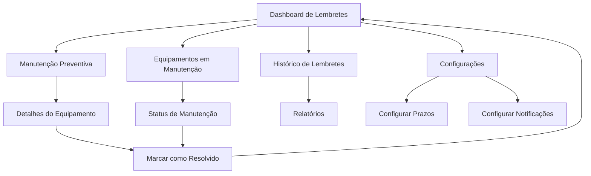

# Sistema de Lembretes de Manutenção - Documento de Requisitos do Produto

## 1. Visão Geral do Produto

O Sistema de Lembretes de Manutenção é uma reformulação da aba "Alertas" existente, focada especificamente em lembretes proativos para manutenção de equipamentos. O sistema monitora automaticamente prazos de manutenção preventiva e controla equipamentos em manutenção, fornecendo alertas antecipados e controle de atrasos.

- **Objetivo Principal**: Garantir que nenhuma manutenção preventiva seja perdida e que equipamentos em manutenção não fiquem esquecidos, otimizando a gestão de ativos da empresa.
- **Público-Alvo**: Técnicos de manutenção, supervisores e gestores de equipamentos que precisam de controle rigoroso sobre cronogramas de manutenção.
- **Valor de Mercado**: Redução de custos operacionais através da manutenção preventiva eficaz e minimização de tempo de inatividade de equipamentos.

## 2. Funcionalidades Principais

### 2.1 Papéis de Usuário

| Papel | Método de Registro | Permissões Principais |
|-------|-------------------|----------------------|
| Técnico de Manutenção | Cadastro interno pelo sistema | Visualizar lembretes, marcar como resolvido, adicionar observações |
| Supervisor de Manutenção | Cadastro interno com privilégios | Todas as permissões do técnico + configurar lembretes, definir prazos |
| Gestor de Equipamentos | Cadastro administrativo | Acesso completo + relatórios, configurações avançadas, histórico completo |

### 2.2 Módulos de Funcionalidades

O sistema de lembretes consiste nas seguintes páginas principais:

1. **Dashboard de Lembretes**: painel principal, resumo de lembretes pendentes, indicadores visuais de urgência, ações rápidas.
2. **Lembretes de Manutenção Preventiva**: lista de equipamentos próximos da manutenção, configuração de antecedência, agendamento automático.
3. **Controle de Equipamentos em Manutenção**: monitoramento de equipamentos fora de operação, controle de prazos de retorno, alertas de atraso.
4. **Histórico de Lembretes**: registro completo de lembretes resolvidos, relatórios de performance, análise de tendências.
5. **Configurações de Lembretes**: definição de prazos de antecedência, configuração de notificações, personalização de alertas.

### 2.3 Detalhes das Páginas

| Nome da Página | Nome do Módulo | Descrição da Funcionalidade |
|----------------|----------------|----------------------------|
| Dashboard de Lembretes | Painel Principal | Exibir resumo de lembretes pendentes por categoria, contadores visuais, gráficos de tendência |
| Dashboard de Lembretes | Indicadores de Urgência | Mostrar lembretes críticos com cores diferenciadas (vermelho para atrasado, amarelo para próximo, verde para normal) |
| Dashboard de Lembretes | Ações Rápidas | Permitir marcar como resolvido, adiar lembrete, visualizar detalhes sem sair da página |
| Manutenção Preventiva | Lista de Equipamentos | Listar equipamentos que precisam de manutenção preventiva nos próximos dias configurados |
| Manutenção Preventiva | Configuração de Antecedência | Definir quantos dias antes da data programada o lembrete deve aparecer (padrão: 7 dias) |
| Manutenção Preventiva | Agendamento Automático | Criar lembretes automaticamente baseados no cronograma de manutenção preventiva |
| Controle de Equipamentos | Monitoramento de Retorno | Acompanhar equipamentos que saíram para manutenção e ainda não retornaram |
| Controle de Equipamentos | Alertas de Atraso | Identificar equipamentos com prazo de retorno vencido, com níveis de atraso (1-3 dias, 4-7 dias, >7 dias) |
| Controle de Equipamentos | Status de Manutenção | Atualizar status do equipamento (em manutenção, aguardando peças, concluído, etc.) |
| Histórico de Lembretes | Registro Completo | Manter histórico de todos os lembretes criados, resolvidos e suas datas |
| Histórico de Lembretes | Relatórios de Performance | Gerar relatórios de tempo médio de resolução, lembretes mais frequentes |
| Histórico de Lembretes | Filtros Avançados | Filtrar por período, tipo de lembrete, equipamento, setor, status |
| Configurações | Prazos de Antecedência | Configurar quantos dias antes alertar para cada tipo de manutenção |
| Configurações | Notificações | Definir quais usuários recebem notificações para cada tipo de lembrete |
| Configurações | Personalização | Customizar cores, sons e frequência de alertas |

## 3. Processo Principal

### Fluxo do Usuário - Técnico de Manutenção
O técnico acessa o dashboard, visualiza lembretes pendentes organizados por prioridade, seleciona um lembrete específico, verifica detalhes do equipamento e histórico, executa a ação necessária (manutenção ou verificação), marca o lembrete como resolvido com observações, e o sistema atualiza automaticamente o status.

### Fluxo do Usuário - Supervisor
O supervisor acessa configurações avançadas, define prazos de antecedência para diferentes tipos de equipamento, configura usuários que devem ser notificados, monitora performance da equipe através de relatórios, e ajusta configurações baseado em análise de dados históricos.

## 4. Design da Interface do Usuário

### 4.1 Estilo de Design

- **Cores Primárias**: Azul (#2563eb) para elementos principais, Verde (#16a34a) para ações positivas
- **Cores Secundárias**: Vermelho (#dc2626) para alertas críticos, Amarelo (#ca8a04) para avisos, Cinza (#6b7280) para elementos neutros
- **Estilo de Botões**: Botões arredondados com sombra sutil, efeito hover com mudança de cor
- **Fonte**: Inter ou system-ui, tamanhos 14px para texto normal, 16px para títulos, 12px para legendas
- **Layout**: Design baseado em cards com espaçamento generoso, navegação superior fixa
- **Ícones**: Lucide React icons com estilo outline, tamanho 16px para botões, 20px para títulos

### 4.2 Visão Geral do Design das Páginas

| Nome da Página | Nome do Módulo | Elementos da UI |
|----------------|----------------|-----------------|
| Dashboard de Lembretes | Painel Principal | Cards com contadores coloridos, gráfico de barras para tendências, lista resumida dos 5 lembretes mais urgentes |
| Dashboard de Lembretes | Indicadores de Urgência | Badges coloridos (vermelho/amarelo/verde), ícones de alerta, números grandes para contadores |
| Manutenção Preventiva | Lista de Equipamentos | Tabela responsiva com filtros, badges de prioridade, botões de ação rápida, modal para detalhes |
| Controle de Equipamentos | Monitoramento | Cards de equipamento com status visual, barra de progresso para tempo em manutenção, timeline de eventos |
| Histórico de Lembretes | Registro Completo | Tabela paginada com busca, filtros dropdown, exportação para Excel, gráficos de performance |
| Configurações | Prazos e Notificações | Formulários organizados em abas, sliders para prazos, checkboxes para usuários, preview das configurações |

### 4.3 Responsividade

O sistema é desktop-first com adaptação para tablets e dispositivos móveis. Em telas menores, os cards se reorganizam em coluna única, tabelas se tornam scrolláveis horizontalmente, e botões de ação se agrupam em menus dropdown. Otimização para touch inclui botões maiores (44px mínimo) e espaçamento adequado entre elementos interativos.