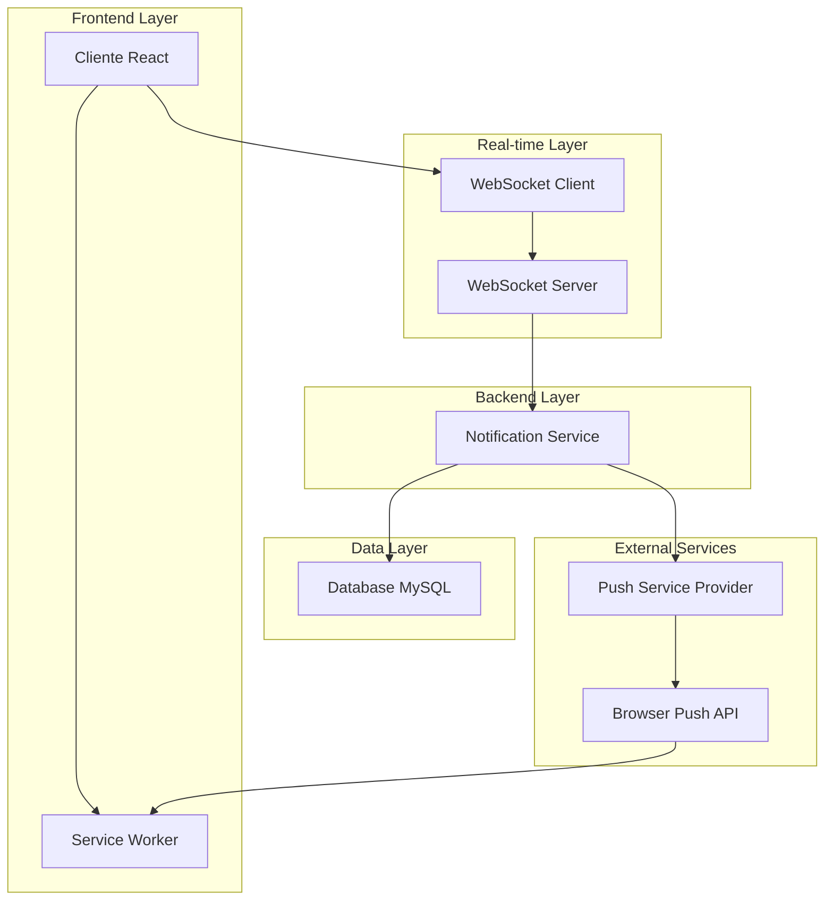
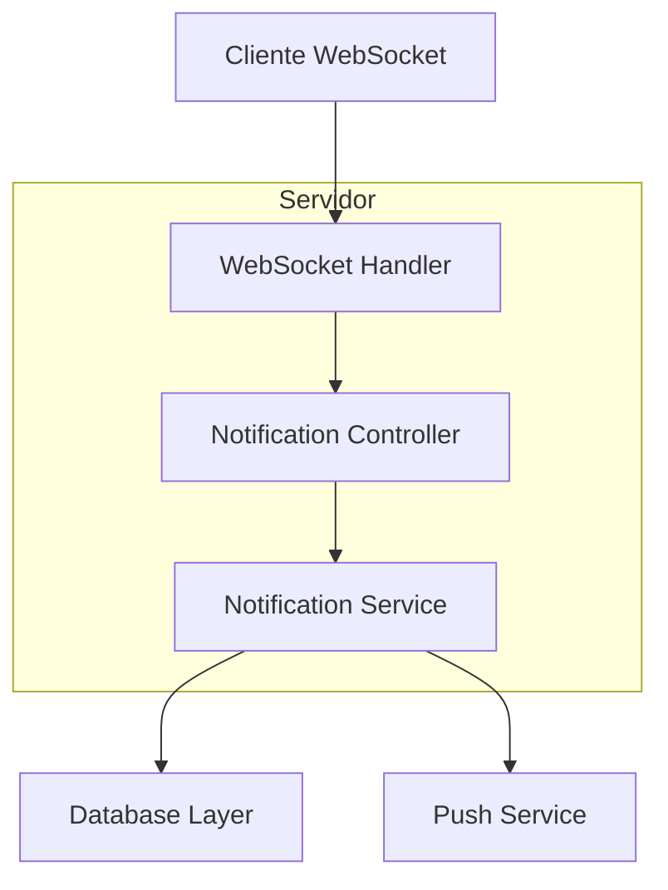
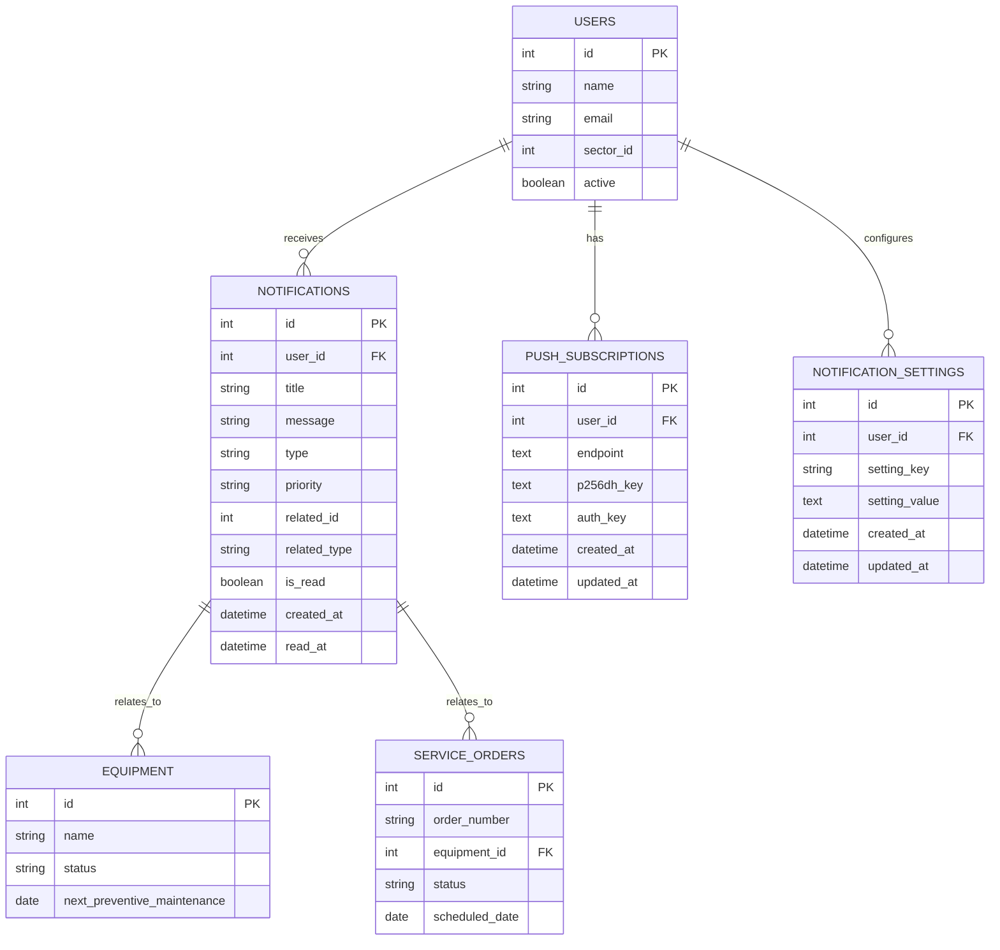

# Sistema de Notificações Push - Arquitetura Técnica

## 1. Arquitetura do Sistema



## 2. Descrição das Tecnologias

- Frontend: React@18 + TypeScript + Tailwind CSS + Next.js@14
- Backend: Node.js + Express + WebSocket (ws library)
- Database: MySQL (existente no sistema)
- Push Service: Web Push Protocol + VAPID keys
- Real-time: WebSocket para atualizações instantâneas
- Service Worker: Para receber notificações push quando app está fechado

## 3. Definições de Rotas

| Rota | Propósito |
|------|-----------|
| /notificacoes | Painel principal de notificações em tempo real |
| /notificacoes/configuracoes | Configurações pessoais de notificação |
| /notificacoes/historico | Histórico completo de notificações recebidas |
| /admin/notificacoes | Configurações globais do sistema (admin apenas) |

## 4. Definições de API

### 4.1 APIs Principais

**Configurações de Notificação**
```
GET /api/notifications/settings
```

Request: Headers com autenticação do usuário

Response:
| Parâmetro | Tipo | Descrição |
|-----------|------|-----------|
| pushEnabled | boolean | Se notificações push estão ativas |
| maintenanceAlerts | boolean | Alertas de manutenção preventiva |
| criticalEquipmentAlerts | boolean | Alertas de equipamentos críticos |
| overdueMaintenanceAlerts | boolean | Alertas de manutenção vencida |
| calibrationReminders | boolean | Lembretes de calibração |
| systemAlerts | boolean | Alertas do sistema |

Exemplo:
```json
{
  "pushEnabled": true,
  "maintenanceAlerts": true,
  "criticalEquipmentAlerts": true,
  "overdueMaintenanceAlerts": true,
  "calibrationReminders": false,
  "systemAlerts": false
}
```

**Registro de Push Subscription**
```
POST /api/notifications/subscribe
```

Request:
| Parâmetro | Tipo | Obrigatório | Descrição |
|-----------|------|-------------|-----------|
| subscription | object | true | Objeto de subscription do browser |
| userId | number | true | ID do usuário |

Response:
| Parâmetro | Tipo | Descrição |
|-----------|------|-----------|
| success | boolean | Status da operação |
| message | string | Mensagem de confirmação |

**Envio de Notificação Push**
```
POST /api/notifications/send
```

Request:
| Parâmetro | Tipo | Obrigatório | Descrição |
|-----------|------|-------------|-----------|
| userId | number | true | ID do usuário destinatário |
| title | string | true | Título da notificação |
| message | string | true | Corpo da mensagem |
| type | string | true | Tipo de notificação |
| priority | string | false | Prioridade (low, medium, high, critical) |
| relatedId | number | false | ID do item relacionado |
| relatedType | string | false | Tipo do item relacionado |

**WebSocket Events**
```
WS /api/notifications/realtime
```

Eventos enviados:
- `notification:new` - Nova notificação recebida
- `notification:read` - Notificação marcada como lida
- `notification:count` - Atualização do contador de não lidas

## 5. Arquitetura do Servidor



## 6. Modelo de Dados

### 6.1 Definição do Modelo de Dados



### 6.2 Linguagem de Definição de Dados (DDL)

**Tabela de Notificações**
```sql
-- Criar tabela de notificações
CREATE TABLE notifications (
    id INT PRIMARY KEY AUTO_INCREMENT,
    user_id INT NOT NULL,
    title VARCHAR(255) NOT NULL,
    message TEXT NOT NULL,
    type ENUM('manutencao_preventiva', 'servico_atrasado', 'equipamento_critico', 'calibracao', 'administrativo') NOT NULL,
    priority ENUM('low', 'medium', 'high', 'critical') DEFAULT 'medium',
    related_id INT NULL,
    related_type ENUM('equipment', 'service_order', 'maintenance') NULL,
    is_read BOOLEAN DEFAULT FALSE,
    created_at TIMESTAMP DEFAULT CURRENT_TIMESTAMP,
    read_at TIMESTAMP NULL,
    FOREIGN KEY (user_id) REFERENCES users(id) ON DELETE CASCADE
);

-- Criar índices para performance
CREATE INDEX idx_notifications_user_id ON notifications(user_id);
CREATE INDEX idx_notifications_created_at ON notifications(created_at DESC);
CREATE INDEX idx_notifications_is_read ON notifications(is_read);
CREATE INDEX idx_notifications_type ON notifications(type);
```

**Tabela de Push Subscriptions**
```sql
-- Criar tabela de push subscriptions
CREATE TABLE push_subscriptions (
    id INT PRIMARY KEY AUTO_INCREMENT,
    user_id INT NOT NULL,
    endpoint TEXT NOT NULL,
    p256dh_key TEXT NOT NULL,
    auth_key TEXT NOT NULL,
    user_agent TEXT NULL,
    created_at TIMESTAMP DEFAULT CURRENT_TIMESTAMP,
    updated_at TIMESTAMP DEFAULT CURRENT_TIMESTAMP ON UPDATE CURRENT_TIMESTAMP,
    FOREIGN KEY (user_id) REFERENCES users(id) ON DELETE CASCADE,
    UNIQUE KEY unique_user_endpoint (user_id, endpoint(255))
);

-- Criar índices
CREATE INDEX idx_push_subscriptions_user_id ON push_subscriptions(user_id);
```

**Tabela de Configurações de Notificação**
```sql
-- Criar tabela de configurações de notificação
CREATE TABLE notification_settings (
    id INT PRIMARY KEY AUTO_INCREMENT,
    user_id INT NOT NULL,
    setting_key VARCHAR(100) NOT NULL,
    setting_value TEXT NOT NULL,
    created_at TIMESTAMP DEFAULT CURRENT_TIMESTAMP,
    updated_at TIMESTAMP DEFAULT CURRENT_TIMESTAMP ON UPDATE CURRENT_TIMESTAMP,
    FOREIGN KEY (user_id) REFERENCES users(id) ON DELETE CASCADE,
    UNIQUE KEY unique_user_setting (user_id, setting_key)
);

-- Inserir configurações padrão para usuários existentes
INSERT INTO notification_settings (user_id, setting_key, setting_value)
SELECT id, 'push_enabled', 'true' FROM users WHERE active = 1;

INSERT INTO notification_settings (user_id, setting_key, setting_value)
SELECT id, 'maintenance_alerts', 'true' FROM users WHERE active = 1;

INSERT INTO notification_settings (user_id, setting_key, setting_value)
SELECT id, 'critical_equipment_alerts', 'true' FROM users WHERE active = 1;

INSERT INTO notification_settings (user_id, setting_key, setting_value)
SELECT id, 'overdue_maintenance_alerts', 'true' FROM users WHERE active = 1;

INSERT INTO notification_settings (user_id, setting_key, setting_value)
SELECT id, 'calibration_reminders', 'false' FROM users WHERE active = 1;

INSERT INTO notification_settings (user_id, setting_key, setting_value)
SELECT id, 'system_alerts', 'false' FROM users WHERE active = 1;
```

**Dados de Teste**
```sql
-- Inserir notificações de teste
INSERT INTO notifications (user_id, title, message, type, priority, related_id, related_type) VALUES
(1, 'Manutenção Preventiva Próxima', 'O equipamento "Compressor AR-001" precisa de manutenção preventiva em 2 dias.', 'manutencao_preventiva', 'medium', 1, 'equipment'),
(1, 'Equipamento Crítico', 'O equipamento "Bomba HID-002" está em estado crítico e requer atenção imediata.', 'equipamento_critico', 'critical', 2, 'equipment'),
(1, 'Ordem de Serviço Atrasada', 'A ordem de serviço OS-2024-001 está atrasada há 3 dias.', 'servico_atrasado', 'high', 1, 'service_order');
```