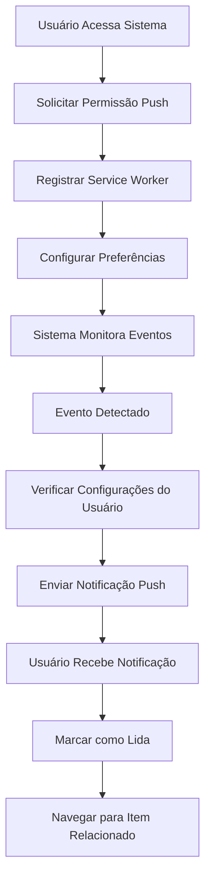

# Sistema de Notificações Push - Requisitos do Produto

## 1. Visão Geral do Produto

O Sistema de Notificações Push é uma funcionalidade integrada ao sistema de manutenção que permite enviar alertas em tempo real para os usuários sobre eventos críticos, manutenções programadas, equipamentos com falhas e ordens de serviço atrasadas. O sistema utiliza notificações nativas do navegador e atualizações em tempo real para garantir que os usuários sejam informados imediatamente sobre situações que requerem atenção.

## 2. Funcionalidades Principais

### 2.1 Papéis de Usuário

| Papel | Método de Registro | Permissões Principais |
|-------|-------------------|----------------------|
| Técnico de Manutenção | Cadastro por administrador | Recebe notificações de equipamentos do seu setor, pode configurar preferências básicas |
| Supervisor | Cadastro por administrador | Recebe notificações de múltiplos setores, acesso a relatórios de notificações |
| Administrador | Acesso total ao sistema | Configuração global de notificações, gerenciamento de usuários e permissões |

### 2.2 Módulos de Funcionalidade

O sistema de notificações consiste nas seguintes páginas principais:

1. **Painel de Notificações**: centro de notificações em tempo real, histórico de alertas, contador de não lidas
2. **Configurações de Notificação**: personalização de tipos de alerta, horários de silêncio, preferências de entrega
3. **Histórico de Notificações**: visualização de todas as notificações recebidas, filtros por tipo e data
4. **Configurações do Sistema**: configurações globais de notificação (apenas administradores)

### 2.3 Detalhes das Páginas

| Nome da Página | Nome do Módulo | Descrição da Funcionalidade |
|----------------|----------------|----------------------------|
| Painel de Notificações | Centro de Notificações | Exibir notificações em tempo real, marcar como lida, navegar para item relacionado, contador de não lidas |
| Painel de Notificações | Histórico de Alertas | Listar todas as notificações recebidas, filtrar por tipo/data/prioridade, buscar notificações específicas |
| Configurações de Notificação | Preferências Pessoais | Ativar/desativar tipos de notificação, configurar horários de silêncio, escolher métodos de entrega |
| Configurações de Notificação | Configurações de Push | Solicitar permissão do navegador, testar notificações, configurar sons e vibração |
| Histórico de Notificações | Visualização Detalhada | Exibir detalhes completos da notificação, ações relacionadas, status de leitura |
| Configurações do Sistema | Configurações Globais | Definir intervalos de verificação, configurar templates de mensagem, gerenciar tipos de alerta |

## 3. Fluxo Principal do Sistema

### Fluxo do Usuário Regular:
1. Usuário acessa o sistema e autoriza notificações push
2. Sistema registra o service worker e obtém subscription
3. Usuário configura suas preferências de notificação
4. Sistema monitora eventos em tempo real
5. Quando evento ocorre, sistema envia notificação push
6. Usuário recebe notificação e pode interagir (marcar como lida, navegar para item)

### Fluxo do Administrador:
1. Administrador configura tipos de notificação globais
2. Define intervalos de verificação automática
3. Configura templates de mensagens
4. Monitora estatísticas de entrega de notificações

## 4. Design da Interface

### 4.1 Estilo de Design

- **Cores Primárias**: Azul (#3B82F6) para notificações normais, Vermelho (#EF4444) para críticas, Amarelo (#F59E0B) para avisos
- **Estilo de Botões**: Botões arredondados com sombra sutil, estados hover e active bem definidos
- **Tipografia**: Inter ou system fonts, tamanhos 14px para texto normal, 16px para títulos de notificação
- **Layout**: Design baseado em cards com espaçamento consistente, sidebar para configurações
- **Ícones**: Heroicons para consistência, ícones específicos para cada tipo de notificação (sino, alerta, engrenagem)

### 4.2 Visão Geral do Design das Páginas

| Nome da Página | Nome do Módulo | Elementos da UI |
|----------------|----------------|-----------------|
| Painel de Notificações | Centro de Notificações | Lista de cards de notificação, badge de contador, botão "marcar todas como lidas", filtros por tipo |
| Painel de Notificações | Histórico de Alertas | Tabela paginada, filtros de data, busca por texto, indicadores de prioridade por cores |
| Configurações de Notificação | Preferências Pessoais | Switches para cada tipo, seletor de horário para modo silencioso, botão de teste |
| Configurações de Notificação | Configurações de Push | Status da permissão, botão para solicitar permissão, preview de notificação |
| Histórico de Notificações | Visualização Detalhada | Modal ou página com detalhes completos, timestamp, ações disponíveis, status visual |
| Configurações do Sistema | Configurações Globais | Formulário com intervalos, editor de templates, estatísticas de entrega |

### 4.3 Responsividade

O sistema é projetado mobile-first com adaptação para desktop. Em dispositivos móveis, o painel de notificações ocupa a tela inteira, enquanto no desktop utiliza uma sidebar. As notificações push funcionam tanto em desktop quanto mobile, com otimizações específicas para cada plataforma.