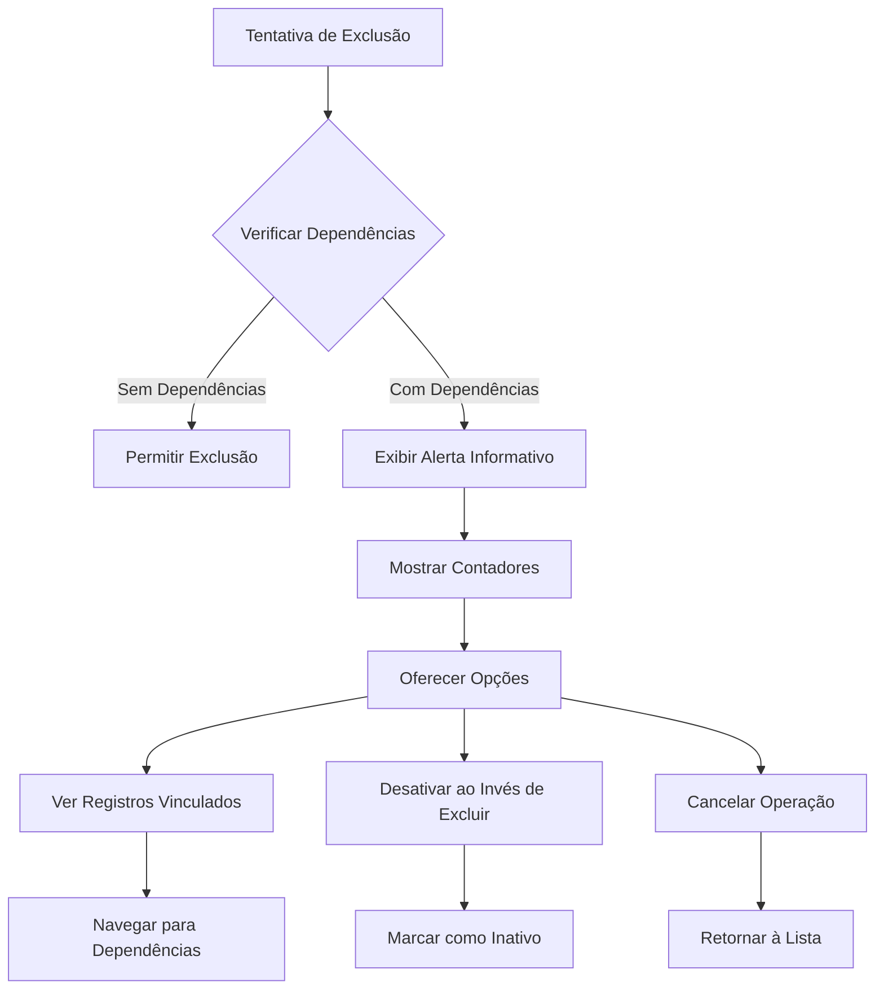

# Sistema de Validação de Integridade Referencial

## 1. Visão Geral do Produto

Este documento define a implementação de um sistema abrangente de validação de integridade referencial para o sistema de manutenção hospitalar. O sistema garante que exclusões de registros vinculados sejam tratadas de forma consistente, informativa e segura em toda a aplicação.

O objetivo é prevenir exclusões acidentais de dados críticos, fornecer feedback claro aos usuários sobre dependências existentes e manter a integridade dos dados do sistema.

## 2. Funcionalidades Principais

### 2.1 Papéis de Usuário

| Papel | Método de Registro | Permissões Principais |
|-------|-------------------|----------------------|
| Administrador | Acesso direto ao sistema | Pode visualizar todas as dependências e receber alertas detalhados sobre exclusões |
| Usuário Operacional | Cadastro por administrador | Pode tentar exclusões mas recebe feedback sobre registros vinculados |
| Usuário Visualizador | Acesso limitado | Apenas visualiza alertas informativos sobre dependências |

### 2.2 Módulos de Funcionalidade

O sistema de validação de integridade referencial consiste nas seguintes páginas principais:

1. **Painel de Validação**: interface centralizada, configurações de validação, relatórios de dependências.
2. **Alertas de Integridade**: notificações em tempo real, histórico de tentativas, sugestões de ação.
3. **Visualizador de Dependências**: mapeamento de relacionamentos, navegação entre registros vinculados.

### 2.3 Detalhes das Páginas

| Nome da Página | Nome do Módulo | Descrição da Funcionalidade |
|----------------|----------------|----------------------------|
| Painel de Validação | Interface Centralizada | Exibir status geral de integridade, configurar regras de validação, visualizar estatísticas de tentativas de exclusão |
| Painel de Validação | Configurações de Validação | Definir regras personalizadas por entidade, configurar mensagens de erro, ativar/desativar validações |
| Painel de Validação | Relatórios de Dependências | Gerar relatórios de relacionamentos, exportar dados de dependências, análise de impacto |
| Alertas de Integridade | Notificações em Tempo Real | Mostrar toast/alertas durante tentativas de exclusão, exibir contadores de registros vinculados, oferecer ações alternativas |
| Alertas de Integridade | Histórico de Tentativas | Registrar todas as tentativas de exclusão, mostrar motivos de falha, permitir auditoria |
| Alertas de Integridade | Sugestões de Ação | Propor desativação ao invés de exclusão, sugerir remoção de dependências, orientar fluxo correto |
| Visualizador de Dependências | Mapeamento de Relacionamentos | Mostrar graficamente as dependências, navegar entre registros relacionados, identificar cadeias de dependência |
| Visualizador de Dependências | Navegação entre Registros | Permitir acesso direto aos registros vinculados, facilitar edição de dependências, mostrar detalhes contextuais |

## 3. Processo Principal

### Fluxo de Validação de Exclusão

O usuário tenta excluir um registro através da interface. O sistema verifica automaticamente se existem registros vinculados na base de dados. Se houver dependências, exibe uma mensagem informativa com o número de registros vinculados e opções de ação. O usuário pode visualizar os registros vinculados, optar por desativar ao invés de excluir, ou cancelar a operação.

### Fluxo de Administrador

O administrador acessa o painel de validação para configurar regras específicas. Define mensagens personalizadas por entidade e ativa validações globais. Monitora tentativas de exclusão através de relatórios e ajusta configurações conforme necessário.

## 4. Design da Interface do Usuário

### 4.1 Estilo de Design

- **Cores Primárias**: #dc2626 (vermelho para alertas), #f59e0b (amarelo para avisos), #10b981 (verde para sucesso)
- **Cores Secundárias**: #6b7280 (cinza para texto secundário), #f3f4f6 (cinza claro para fundos)
- **Estilo de Botões**: Arredondados com bordas suaves, efeitos de hover sutis
- **Fontes**: Inter ou system fonts, tamanhos 14px (texto), 16px (botões), 18px (títulos)
- **Estilo de Layout**: Cards com sombras suaves, navegação superior fixa
- **Ícones**: Lucide React ou Heroicons, estilo outline para consistência

### 4.2 Visão Geral do Design das Páginas

| Nome da Página | Nome do Módulo | Elementos da UI |
|----------------|----------------|-----------------|
| Painel de Validação | Interface Centralizada | Cards com estatísticas, gráficos de barras para dependências, tabela responsiva com filtros |
| Painel de Validação | Configurações de Validação | Formulários com switches toggle, campos de texto para mensagens, dropdowns para seleção de entidades |
| Alertas de Integridade | Notificações em Tempo Real | Toast notifications com ícones de alerta, botões de ação coloridos, contadores com badges |
| Visualizador de Dependências | Mapeamento de Relacionamentos | Diagrama interativo com nós e conexões, zoom e pan, tooltips informativos |

### 4.3 Responsividade

O sistema é projetado mobile-first com adaptação para desktop. Inclui otimização para interação touch em dispositivos móveis, com botões de tamanho adequado e gestos intuitivos para navegação entre dependências.